<p align="center">
  
</p>

# Luma — 2026 Capstone 18

[](https://github.com/kookmin-sw/2026-capstone-18/commits/master)
[](https://github.com/kookmin-sw/2026-capstone-18/commits/master)
[](https://github.com/kookmin-sw/2026-capstone-18/pulse)
[](https://github.com/kookmin-sw/2026-capstone-18/graphs/contributors)
[](LICENSE)
[](https://github.com/kookmin-sw/2026-capstone-18/stargazers)

<p align="center">
  <video src="https://github.com/user-attachments/assets/9077115f-dcfc-4898-a309-afc126edbf79" controls muted playsinline width="320"></video>
</p>

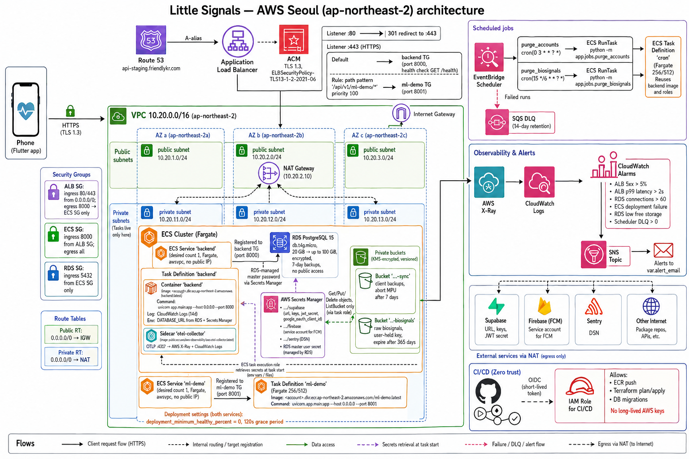

여성 사용자를 위한 실시간 스트레스 탐지 및 생리 주기 추적 애플리케이션입니다. Galaxy Watch 8에서 수집한 생체신호(PPG, EDA, HRV, 가속도)를 스마트폰 온디바이스(Mamba) 환경에서 분석하여 스트레스 이벤트를 탐지하며, 감지 결과를 앱 UI에 표시하고 필요한 경우 스트레스 기록 흐름으로 연결합니다. 백엔드는 AWS 서울 리전(ap-northeast-2)에 배포되어 있으며, 한국의 개인정보보호법(PIPA)을 준수하도록 설계되었습니다.

- **팀**: 국민대학교 2026 캡스톤 18조
- **팀페이지**: <https://kookmin-sw.github.io/2026-capstone-18/>
- **타깃 플랫폼**: Galaxy Watch 8 (Wear OS) + Android (Flutter)
- **배포 리전**: AWS Seoul (`ap-northeast-2`)

### 기술 스택

**Backend**


**Cloud / Infra**


**AI / ML**


**Frontend / Watch**


**Quality / Tooling**


---

## 목차

- [저장소 구조](#저장소-구조)
- [선행 요구사항](#선행-요구사항)
- [1. AI — 스트레스 탐지 (Mamba)](#1-ai--스트레스-탐지-mamba)
  - [1.1 주요 기술 결정](#11-주요-기술-결정)
  - [1.2 9-채널 입력 텐서 매핑](#12-9-채널-입력-텐서-매핑)
  - [1.3 빠른 시작](#13-빠른-시작)
- [2. Backend — FastAPI on AWS Seoul](#2-backend--fastapi-on-aws-seoul)
  - [2.1 설계 원칙](#21-설계-원칙)
  - [2.2 기술 스택](#22-기술-스택)
  - [2.3 인프라 (Terraform)](#23-인프라-terraform)
  - [2.4 데이터 모델 (요약)](#24-데이터-모델-요약)
  - [2.5 API 요약](#25-api-요약)
  - [2.6 로컬 개발](#26-로컬-개발)
  - [2.7 스테이징 배포](#27-스테이징-배포)
  - [2.8 Agentic AI — Bedrock + Claude Haiku 4.5](#28-agentic-ai--bedrock--claude-haiku-45)
- [3. Wear OS — Galaxy Watch 8 센서 캡처](#3-wear-os--galaxy-watch-8-센서-캡처)
  - [3.1 캡처 채널](#31-캡처-채널)
  - [3.2 SDK 검증 결과 (2026-05-04)](#32-sdk-검증-결과-2026-05-04)
  - [3.3 출력 레이아웃](#33-출력-레이아웃)
  - [3.4 빌드와 실행](#34-빌드와-실행)
  - [3.5 데이터 추출](#35-데이터-추출)
- [4. Frontend — Flutter Android App](#4-frontend--flutter-android-app)
  - [4.1 Frontend 개요](#41-frontend-개요)
  - [4.2 설계 목표](#42-설계-목표)
  - [4.3 기술 스택](#43-기술-스택)
  - [4.4 구현된 주요 기능](#44-구현된-주요-기능)
  - [4.5 Architecture 요약](#45-architecture-요약)
  - [4.6 사용자 흐름](#46-사용자-흐름)
  - [4.7 Frontend Data Flow](#47-frontend-data-flow)
  - [4.8 Backend Integration](#48-backend-integration)
  - [4.9 Native Capture Integration](#49-native-capture-integration)
  - [4.10 Notification Flow](#410-notification-flow)
  - [4.11 Frontend 실행과 테스트](#411-frontend-실행과-테스트)
- [5. 아키텍처 전체 흐름 (요약)](#5-아키텍처-전체-흐름-요약)
- [6. 문서](#6-문서)
- [7. 팀 소개](#7-팀-소개)
- [8. 시연 영상](#8-시연-영상)
- [기여 가이드](#기여-가이드)
- [라이선스](#라이선스)

---

## 저장소 구조

```text
2026-capstone-18/
├── AI/                       # 스트레스 탐지 Mamba 파이프라인 (학습/평가, 60s 윈도우 이진 분류)
│   ├── notebooks/
│   └── src/
│       ├── dataset/          # WESAD / Stress-Predict 다운로드·전처리
│       ├── mamba_model.py    # Pure PyTorch Mamba 아키텍처
│       ├── train.py          # 5-Fold GroupKFold 학습 루프
│       ├── train_LOSO.py     # Leave-One-Subject-Out 검증
│       └── train_fp_fold1.py # 단일 fold full-precision 학습
├── backend/                  # FastAPI 백엔드 + Terraform 인프라
│   ├── app/                  # 라우터·서비스·모델·스키마·관측성
│   ├── alembic/              # DB 마이그레이션
│   ├── infra/                # Terraform (ECS, RDS, ALB, S3, EventBridge)
│   ├── scripts/              # 부트스트랩·마이그레이션·스모크 테스트
│   └── docs/                 # 스프린트별 배포 런북
├── watch/
│   └── sensor-capture/       # Wear OS 원시 센서 수집 유틸 (Kotlin)
├── README.md
└── index.md                  # GitHub Pages 진입점
```

---

## 선행 요구사항

전체 시스템(AI 학습 → 백엔드 → Watch → Flutter 앱)을 로컬·스테이징에서 구동하려면 다음 계정·도구·하드웨어가 필요합니다. 각 영역만 단독으로 실행할 때 필요한 항목은 하단 "필수 영역" 열을 참고하세요.

| 분류 | 항목 | 용도 | 필수 영역 | 비용 (베타 코호트 기준) |
| :--- | :--- | :--- | :--- | :--- |
| 클라우드 | **AWS 계정 (Seoul `ap-northeast-2`)** | ECS Fargate, RDS Postgres 15, ALB, S3, EventBridge, Secrets Manager, CloudWatch, SQS, ECR, Route53, ACM | Backend 배포 | Free Tier + 소액 사용량 |
| 인증 | **Supabase 프로젝트** | JWT 발급, 익명 사용자, Google OAuth 교환 | Backend, Frontend | Free Tier |
| 푸시 | **Firebase 프로젝트** | Cloud Messaging(FCM) 토큰 등록 + 백그라운드 푸시 | Backend, Frontend | Free |
| OAuth | **Google Cloud 프로젝트** (OAuth 클라이언트) | Supabase Auth와 연동되는 Google 로그인 | Frontend | Free |
| 도메인 | 사용자 소유 도메인 1개 | 스테이징 ACM/Route53 (`api-staging.<도메인>`) | Backend 배포 | 기존 도메인 재사용 |
| CI/CD | **GitHub** (조직 권한) | GitHub Actions로 ECR 푸시·Terraform plan·마이그레이션 실행 | 전 영역 | Public 저장소 무료 |
| 로컬 도구 | Python 3.12 (pyenv), Poetry 2.x, Docker Desktop, `psql`, `jq` | 백엔드 로컬 개발/테스트 | Backend | — |
| 로컬 도구 | Terraform 1.7+, AWS CLI v2 | 인프라 프로비저닝 | Backend 배포 | — |
| 로컬 도구 | Flutter SDK (stable), Android Studio Iguana 이상, Android SDK 34+ | Phone 앱 빌드 | Frontend | — |
| 로컬 도구 | Android Studio + Wear OS 에뮬레이터/실기기, `adb` | Watch 캡처 도구 빌드 | Watch | — |
| 하드웨어 | **Galaxy Watch 8** (개발자 모드, 80% 이상 충전) | 4채널 원시 센서 캡처 + Wear Data Layer로 폰 실시간 스트리밍 | Watch | — |
| 하드웨어 | Android 폰 (Galaxy Z Flip 5 등) | Flutter 앱 실기기 테스트 | Frontend | — |
| SDK | Samsung Health Sensor SDK 1.4.1 (`samsung-health-sensor-api-1.4.1.aar`) | Watch 센서 채널 접근 | Watch | 저장소에 포함 |

각 도구의 정확한 버전 핀은 `backend/pyproject.toml`, `backend/infra/versions.tf`, `frontend/pubspec.yaml`, `watch/sensor-capture/build.gradle.kts`에서 확인합니다.

---

## AI — 생체신호 기반 스트레스 탐지 파이프라인

WESAD 및 StressPredict 데이터셋을 통합 활용하여 연속적인 생체신호(PPG, EDA, ACC)로부터 스트레스 상태를 탐지하는 시계열 분류(TSC) 파이프라인입니다. 본 시스템의 목적은 일상생활 중 발생하는 스트레스 이벤트를 감지하고, 온디바이스 환경에서 감지 신호를 앱 UI와 스트레스 기록 흐름으로 연결하는 것입니다.

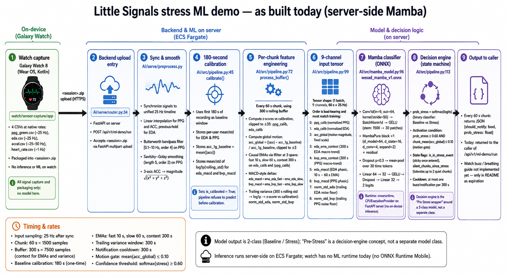

> ℹ️ 위 다이어그램은 *오프라인 검증 경로*(서버에 zip을 업로드해 모델 출력 회귀를 확인하는 데모 도구)를 보여줍니다. 현재 실제 운영 경로는 §1과 §5의 다이어그램을 따르며 워치 → 폰 스트리밍 + 폰 온디바이스 추론으로 동작합니다.

### 1. 시스템 아키텍처 (On-Device Inference)
데이터의 수집부터 추론, 알림 트리거까지의 과정은 개인정보보호(PIPA)를 엄격히 준수하도록 설계되었습니다.
* **Galaxy Watch (Sensor Node):** PPG, EDA, HRV, Accelerometer 센서 데이터를 25Hz로 캡처하여 60초 단위로 스마트폰에 실시간 스트리밍합니다. (워치 내부에서는 ML 추론이 발생하지 않습니다.)
* **Smartphone App (Inference & Decision Engine):** 스마트폰의 Android-native 레이어(Kotlin + `onnxruntime-android` 1.18.0)에서 Mamba 모델이 온디바이스로 실행됩니다. 60초 슬라이딩 윈도(300s 버퍼) 단위로 추론을 수행하고, 모션 게이트·쿨다운 기반 결정 로직으로 감지 결과 표시와 이벤트 기록 여부를 판단합니다. 결과는 Flutter UI에 platform channel(`littlesignals/capture/detections`)로 전달되어 카드 형태로 표시되며, 동시에 백엔드 `POST /api/v1/events`로 기록됩니다.
* **Backend Server (Privacy Logging):** 최종 스트레스 이벤트 로그와 메타데이터만 서버로 전송되며, 원시 생체신호는 사용자 기기 외부로 절대 유출되지 않습니다.

---

### 2. 데이터셋 엔지니어링 및 전처리 (Unified Binary Classification)
다양한 환경의 생체신호를 학습하기 위해 WESAD(통제 환경)와 StressPredict(일상/Ambulatory 환경) 데이터셋을 이진 분류(Baseline vs. Stress) 태스크로 통합했습니다. 휴식, 명상, 즐거움 등의 상태는 모두 Class 0(Baseline)으로 매핑됩니다.

**2.1 비대칭 학습 및 평가 전략 (Asymmetric Setup)**
타겟 사용자층에 맞춘 견고한 증명을 위해 비대칭 스플릿을 적용했습니다.
* **Training Split (정규화 및 다양성):** 전체 WESAD(15명) 및 StressPredict(35명) 피험자를 모두 학습에 포함하여 생물학적 다양성과 정규화 효과를 확보했습니다.
* **Evaluation Split (타겟 검증):** 모델이 타겟 인구통계에서 안정적으로 작동하는지 확인하기 위해, 여성 비율이 압도적으로 높은 분할(WESAD 여성 피험자 + StressPredict 전체)을 구성하여 검증했습니다.
* **Deployment Model Selection:** K-Fold 평균에 의존하지 않고, 모델 안정성을 확인하기 위해 가장 대표적인 피험자 5명(WESAD 1명, StressPredict 4명)을 Hold-out Validation으로 분리해 최종 배포 모델을 선정했습니다.

**2.2 텐서 아키텍처 및 9-채널 입력 (`[Batch, 9, 1500]`)**
Galaxy Watch 8 SDK 출력에 맞춰 25Hz 목표 주파수로 동기화되었으며, 60초 윈도우(Stride 5초)를 사용합니다. 

| 인덱스 | 피처명 | 설명 및 연산 방식 |
| :---: | :--- | :--- |
| **0** | `ppg_calib` | 4차 Butterworth 및 Savitzky-Golay 필터링된 PPG 신호 (Z-Score) |
| **1** | `eda_calib` | 절대 피부 전도도 (Z-Score) |
| **2** | `acc_global` | 전역 물리적 활동량 (1g 휴식 기준 매핑, [-3.0, 3.0] 클리핑) |
| **3** | `eda_ema_context` | 300초(5분) Causal EMA (EDA 거시 추세) |
| **4** | `bvp_ema_context` | 300초(5분) Causal EMA (PPG 거시 추세) |
| **5** | `eda_macd` | EDA Phasic 변화량 (10s EMA - 60s EMA) |
| **6** | `bvp_macd` | PPG Phasic 변화량 (10s EMA - 60s EMA) |
| **7** | `norm_std_eda` | 300초 후행 EDA 노이즈 분산 (Log-compressed, Z-Score) |
| **8** | `norm_std_bvp` | 300초 후행 PPG 노이즈 분산 (Log-compressed, Z-Score) |

**2.3 최종 클래스 분포**
* **Full Training Pool:** 총 38,742 Chunks (~53.8 시간) | Class 0: 75.87% / Class 1: 24.13%
* **Evaluation Pool:** 총 25,322 Chunks (~35.2 시간) | Class 0: 69.32% / Class 1: 30.68%

---

### 3. 모델 아키텍처 및 학습
엣지 환경에서의 원활한 ONNX 변환 및 CPU 추론을 위해, `mamba-ssm`의 CUDA 커널 의존성을 제거한 순수 PyTorch 기반 Selective SSM을 설계했습니다.

**3.1 차원 축소 및 흐름**
1. **Conv1d Stem:** `[Batch, 9, 1500]` 크기의 입력은 Kernel/Stride가 50인 1D 합성곱을 통과하여 지역적 특징을 추출하고 `[Batch, 64, 30]`으로 공격적인 다운샘플링을 수행합니다.
2. **Selective SSM (MambaPure):** `[Batch, 30, 64]`로 Permute된 텐서는 $d\_state=16$, $dconv=4$로 설정된 Mamba 블록을 통과하며 시간적 의존성을 모델링합니다. (연산량 최소화를 위해 Forward-only 스캔 채택).
3. **Global Pooling & Classifier:** `mean(dim=1)` 풀링으로 시간 차원을 압축한 후, 두 개의 선형 계층(64 -> 32 -> 2)을 거쳐 최종 이진 Logit을 출력합니다.

**3.2 인스턴스 가중치 초점 손실 (Instance-Weighted Focal Loss)**
데이터셋 간의 노이즈 차이와 클래스 불균형을 극복하기 위해, 예측이 쉬운 Baseline Chunk의 그래디언트 기여도를 억제하는 Focal Loss($\gamma=3.0$)를 적용했습니다.

$$L = \frac{1}{N} \sum_{i=1}^{N} w_i \cdot (1 - p_{t,i})^3 \cdot \text{CE}(x_i, y_i)$$

현실적인 노이즈가 포함된 StressPredict의 Stress 이벤트 누락에 가장 큰 수학적 페널티를 부여하기 위해 그리드 서치 기반 가중치($w_i$)를 적용했습니다:
* **WESAD Baseline:** 0.5
* **WESAD Stress:** 1.0
* **StressPredict Baseline:** 1.0
* **StressPredict Stress:** 2.0

---

### 4. 스트레스 감지 결정 엔진
단순한 Softmax 확률값에 의존하지 않고, False Alarms으로 인한 사용자 피로도를 극단적으로 낮추기 위해 4단계 UX 상태 머신 필터를 적용합니다.

* **Confidence Threshold:** 모델의 스트레스 확률값이 60% 이상일 때만 활성화.
* **Motion Artifact Rejection (MAR 0.10):** 60초 구간의 평균 가속도 크기가 0.10을 초과하면 움직임 노이즈로 간주하여 확률값과 무관하게 스트레스 판정 기각.
* **Gap Bridging (120s):** 신호 단절을 보정하기 위해, 120초(2 Chunks) 연속 평상시 상태가 유지되어야 스트레스 이벤트가 종료된 것으로 간주.
* **Notification Cooldown (300s):** 알림 피로도 방지를 위해 감지 신호 발생 후 5분간 추가 신호 차단.

---

### 5. 성능 평가 및 UX 지표
모델 평가는 단순한 Chunk 단위의 F1-Score를 넘어 실제 스마트워치 알림의 품질을 대변하는 **UX Robustness Metrics**에 중점을 두었습니다. (UX Score = Mean Detection Rate - (Mean False Alarms * 20)).

| Model | Acc | F1 | Prec | Rec | Mean_Det(%) | Mean_FA | UX_Score |
| :--- | :--- | :--- | :--- | :--- | :--- | :--- | :--- |
| Fold 2 | 0.895 | 0.821 | 0.801 | 0.843 | 83.900 | 1.500 | 78.900 |
| Fold 5 | 0.872 | 0.775 | 0.779 | 0.771 | 65.100 | 3.170 | 54.500 |
| Fold 1 | 0.858 | 0.765 | 0.726 | 0.808 | 56.200 | 1.580 | 51.000 |
| Fold 3 | 0.809 | 0.663 | 0.670 | 0.657 | 44.300 | 0.250 | 43.400 |
| Fold 4 | 0.752 | 0.544 | 0.573 | 0.518 | 0.000 | 0.000 | 0.000 |
| **K-Fold Average** | **0.837** | **0.714** | **0.710** | **0.719** | **49.900** | **1.300** | **45.600** |
| **Official WESAD w2.0** | **0.751** | **0.522** | **0.580** | **0.474** | **62.500** | **0.250** | **61.700** |

**결론:**
최종 배포용으로 채택된 Official 모델은 평균 K-Fold 대비 파편화된 정확도(Acc: 0.751)와 재현율이 다소 낮습니다. 그러나 피험자당 오알림 횟수(Mean_FA)를 1.3회에서 **0.25회**로 압도적으로 억제하여 최종 UX Score(61.700)에서 월등한 성능을 보입니다. 이는 잦은 오알림으로 인한 시스템 신뢰도 하락을 방지해야 하는 스트레스 감지 UX에 가장 부합하는 결과입니다.


## 2. Backend — FastAPI on AWS Seoul

100명 규모 베타 코호트를 대상으로 인증, 데이터 영속화, Watch–Phone 실시간 동기화, 옵트인 암호화 생체신호 보관, 감사 로그를 제공하는 서비스입니다. Firebase로 빠르게 만들 수도 있지만, 본 프로젝트는 시니어 수준의 백엔드 역량 자체를 산출물로 보여주기 위해 의도적으로 커스텀 백엔드 경로를 선택했습니다.

### 2.1 설계 원칙

1. **아키텍처로서의 프라이버시** — AWS, Supabase, 본 애플리케이션 중 어느 한쪽이 침해되더라도 사용자의 원시 생체신호는 복호화 불가능해야 한다. 사용자가 보유한 키 기반 E2E 암호화, 옵트인 업로드, 온디바이스 ML이 약속이 아닌 구조로 보장한다.
2. **필요한 것만 짓는다** — "쓸모 있을 수 있다"로 포장된 스코프 확장을 거절한다. 모든 컴포넌트는 PoC 스코프를 기준으로 자체 정당화를 통과해야 한다.
3. **운영은 1급 시민** — 로그·메트릭·트레이스·CI/CD를 애플리케이션 코드와 같은 시점에 설계한다. 관측 가능성은 v2의 과제가 아니다.
4. **표준 도구를 잘 쓴다** — Postgres, FastAPI, Terraform, GitHub Actions. 도구 선택의 화려함이 아니라 *어떻게 쓰는지*로 시니어 수준을 보인다.
5. **무엇이 아니라 왜를 문서화한다** — 결정의 근거를 보존하여 6개월 뒤의 자신·팀·검토자가 *왜*를 이해할 수 있게 한다.

#### 프라이버시 데이터 흐름 (옵트인 원시 생체신호)

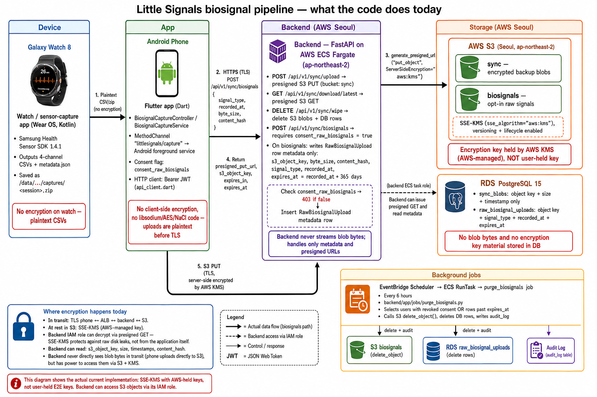

- **블롭 바이트는 백엔드를 거치지 않습니다** — 폰이 presigned URL로 S3에 직접 PUT (`generate_presigned_url("put_object", ServerSideEncryption="aws:kms")`).
- **백엔드가 영속화하는 메타데이터**: `RawBiosignalUpload` 행은 `s3_object_key`, `signal_type`, `recorded_at`, `uploaded_at`, `expires_at`만 저장합니다. 요청 페이로드의 `byte_size`·`content_hash`는 검증용이며 DB에는 저장되지 않습니다.
- **현재 저장 시 암호화**: SSE-KMS (AWS 관리 키 `aws/s3`). 다이어그램의 클라이언트 측 사용자 보유 DEK 암호화는 §2.1의 약속을 코드 수준으로 끌어올리기 위한 후속 작업이며, 현재 코드베이스에는 `libsodium`/`AES`/`NaCl` 의존성이 없습니다.
- **자동 만료 + 감사**: `recorded_at + 365일`. EventBridge Scheduler가 6시간 주기로 만료/동의 철회 행을 골라 S3 `delete_object`·DB row 삭제·`audit_log` 기록까지 한 번에 처리합니다 ([backend/app/jobs/purge_biosignals.py](backend/app/jobs/purge_biosignals.py)).

### 2.2 기술 스택

| 영역 | 선택 | 비고 |
| :--- | :--- | :--- |
| 언어/런타임 | Python 3.12 | ML 파이프라인과 동일 언어 |
| 웹 프레임워크 | FastAPI 0.136 | HTTP + WebSocket, 자동 OpenAPI |
| ASGI 서버 | uvicorn (`[standard]`) | 프로덕션은 다중 워커 |
| ORM / 드라이버 | SQLAlchemy 2.0 (asyncio) + asyncpg | 비동기 I/O |
| 마이그레이션 | Alembic | `backend/alembic/versions` |
| 검증 | Pydantic v2 + `pydantic-settings` | 환경변수 기반 설정 |
| 인증 | Supabase Auth (JWT 발급) + `python-jose` (검증) | 익명 우선 + Google OAuth |
| 알림 | Firebase Cloud Messaging (`firebase-admin`) | 백그라운드 푸시 |
| 객체 저장소 | AWS S3 (`boto3`) + presigned URL | 옵트인 암호화 블롭 |
| 로깅 | `structlog` → CloudWatch | 구조화 JSON, `trace_id` 포함 |
| 정적 검사 | `ruff`, `mypy --strict` | 라인 100, py312 타깃 |
| 테스트 | `pytest`, `pytest-asyncio`, `httpx`, `respx`, `moto` | 커버리지 = `sysmon` |
| HTTP 클라이언트 | `httpx` (+ `httpx-ws`) | 외부 호출/테스트 공용 |

### 2.3 인프라 (Terraform)

| 컴포넌트 | 역할 |
| :--- | :--- |
| VPC (퍼블릭/프라이빗 서브넷, IGW, NAT Gateway, EIP) | 3-AZ 네트워킹 (각 AZ에 퍼블릭/프라이빗 서브넷 1개씩), 단일 NAT GW로 비용 최적화, 프라이빗 서브넷에서 ECS·RDS 가동 |
| 보안 그룹 (`alb`, `ecs`, `rds`) | ALB→ECS→RDS 단방향 트래픽 경계 |
| Application Load Balancer | `/api/v1/*`, `/ws/realtime`, `/admin/*` 라우팅 (HTTP→HTTPS 리다이렉트) |
| ACM 인증서 + Route53 | `api-staging.friendlykr.com` TLS, DNS 검증 자동화, A 레코드 자동 등록 |
| ECS Fargate (desired_count = 1, 512 CPU / 1024 MiB) + ECS Cluster | FastAPI 애플리케이션 + WebSocket 호스팅 (오토스케일링 미설정 — 베타 코호트 100명 규모에 맞춘 단일 태스크) |
| ECS Task Definition (`backend`, `cron`) | 서비스 컨테이너와 EventBridge가 호출하는 일회성 잡 컨테이너 분리 |
| IAM Role (`ecs_execution`, `ecs_task`, `scheduler`) | 시크릿 풀링 / 런타임 권한 / 스케줄러의 `RunTask` + `PassRole` |
| ECR (lifecycle policy 포함) | 컨테이너 이미지 레지스트리, 미사용 태그 자동 정리 |
| RDS Postgres 15 | 관계형 데이터(`stress_events`, `cycles`, `raw_biosignal_uploads` 등) |
| S3 `sync` (Seoul, SSE, versioning, lifecycle) | 옵트인 암호화 백업 블롭 (`/api/v1/sync`) |
| S3 `biosignals` (Seoul, SSE, versioning, lifecycle) | 옵트인 원시 생체신호 — 사용자 보유 키로 암호화, 서버 복호화 불가 |
| EventBridge Scheduler + ECS RunTask | `purge_accounts` 매일 03:00 UTC · `purge_biosignals` 6시간 주기 · `weekly_reports` 토 17:00 UTC (= 일 02:00 KST, §2.8) |
| AWS Bedrock (Anthropic Claude Haiku 4.5) | 패턴 팁 + 주간 리포트 생성, IAM에서 Haiku 4.5 인퍼런스 프로파일 + 그 하부 foundation-model에만 `InvokeModel` 허용 (§2.8) |
| SQS DLQ + CloudWatch Metric Alarm | 스케줄러 실패 격리 + DLQ depth 알람 |
| CloudWatch Log Groups (`backend`, `cron`) | structlog JSON 로그 수집 |
| Secrets Manager (`supabase`, `firebase`) | Supabase 서비스 키 / Firebase Admin 자격증명 |

전체 정의는 [`backend/infra/`](backend/infra/) — `networking.tf`, `alb.tf`, `ecs.tf`, `ecr.tf`, `rds.tf`, `s3.tf`, `scheduler.tf`, `secrets.tf`.

### 2.4 데이터 모델 (요약)

`users`, `user_settings`, `stress_events`(하이퍼테이블, `detected_at`), `cycles`, `raw_biosignal_uploads`(하이퍼테이블, `recorded_at`, 옵트인), `sync_blobs`, `websocket_connections`, `fcm_tokens`, `audit_log`(append-only, `(action, occurred_at)` 인덱스). 본문 자유 텍스트는 클라이언트 측에서 암호화된 상태로 저장되며, 원시 생체신호는 사용자 보유 키로 암호화된 후 S3에 업로드되어 서버는 복호화할 수 없습니다.

### 2.5 API 요약

- `auth/*` — 익명 발급, Google OAuth 교환, refresh, logout
- `account/*` — 등록, 익명→등록 전환, 30일 유예 삭제
- `events/*` — 스트레스 이벤트 CRUD
- `cycles/*` — 생리 기록, 현재 phase, 히스토리
- `settings/*` — 사용자 환경설정
- `consent/*` — 동의 토글 + 감사 기록
- `sync/{upload,download}` — 옵트인 암호화 백업
- `sync/biosignals` — 옵트인 원시 생체신호 업로드
- `devices/fcm-token` — FCM 토큰 등록
- `ws/realtime` — Watch ↔ Phone 실시간 채널 (JWT in query)
- `insights/tips/{pattern_key}` — Bedrock(Haiku 4.5) 기반 패턴 카드 팁, 24h 캐시 (§2.8)
- `reports/weekly` — 주간 잡이 미리 생성한 한국어 리포트 조회 (§2.8)

스프린트 1 단계의 헬스체크: `GET /health → {"status":"ok","version":"0.1.0"}`. Swagger는 `/docs`, ReDoc은 `/redoc`, OpenAPI는 `/openapi.json`.

### 2.6 로컬 개발

사전 요구사항: Python 3.12 (pyenv), Poetry 2.x, Docker(Compose v2), `psql`.

```bash
cd backend
poetry install
docker compose up -d        # Postgres 15 + TimescaleDB + Adminer
make migrate                # alembic upgrade head
poetry run uvicorn app.main:app --reload
```

기본 접속: Postgres `localhost:5432` (`little_signals` / `dev_only_password` / `little_signals_dev`), Adminer `http://localhost:8080`. 5432 포트 충돌 시 Homebrew Postgres를 일시 중지하세요(`brew services stop postgresql@15`).

테스트:

```bash
poetry run pytest
make migrate-test
```

정적 검사:

```bash
poetry run ruff check .
poetry run ruff format --check .
poetry run mypy app/
```

### 2.7 스테이징 배포

```bash
cd backend
AWS_PROFILE=little-signals-staging ./scripts/bootstrap-terraform-state.sh
cd infra
cp backend.hcl.example backend.hcl
AWS_PROFILE=little-signals-staging terraform init -backend-config=backend.hcl
AWS_PROFILE=little-signals-staging terraform apply -var-file=staging.tfvars
cd ..
AWS_PROFILE=little-signals-staging make ecr-login
AWS_PROFILE=little-signals-staging make ecr-push IMAGE_TAG=0.7.0
cd infra
ECR_URL="$(AWS_PROFILE=little-signals-staging terraform output -raw ecr_repository_url)"
AWS_PROFILE=little-signals-staging terraform apply \
  -var-file=staging.tfvars \
  -var "container_image=$ECR_URL:0.7.0"
cd ..
AWS_PROFILE=little-signals-staging ./scripts/run-staging-migration.sh
make smoke-staging
```

스테이징 URL: `https://api-staging.friendlykr.com`.

### 2.8 Agentic AI — Bedrock + Claude Haiku 4.5

![Agentic AI architecture — Flow 1 (on-demand tip generation): Phone → FastAPI → RDS pattern_tips cache, miss → Bedrock InvokeModel → upsert → response. Flow 2 (scheduled weekly report): EventBridge cron(Sat 17:00 UTC) → ECS RunTask → aggregate stress + sleep + cycle → Bedrock JSON-schema prompt → upsert weekly_reports. Privacy & Safety panel — sent: display_name, category, phase, deltas, summary lines; never sent: UUID, email, free text, raw biosignals, FCM tokens. Tech stack: Flutter, FastAPI, ECS Fargate, RDS Postgres, Bedrock (Claude Haiku 4.5), EventBridge, AWS IAM.](docs/images/agenticai.png)

기존 통계 기반 패턴 탐지(§1의 Mamba 탐지와는 별개) 위에 LLM이 두 가지 형태로 사용자 경험을 보강합니다. 모든 호출은 백엔드 ECS에서 출발하며, 폰은 결과 텍스트만 받습니다.

**왜 별도 레이어인가**: §1의 Mamba는 *탐지*(60초 생체신호 윈도우의 마지막 5초 구간을 Baseline/Stress 이진 분류), 이 레이어는 *해석/요약*(이미 일어난 패턴을 자연어로 풀어주는 생성형). 두 모델은 입력·운영·비용 특성이 모두 달라 같은 코드 경로에 묶지 않았습니다.

| 표면 | 트리거 | 캐시/주기 | 출력 |
| :--- | :--- | :--- | :--- |
| 패턴 카드 팁 | `GET /api/v1/insights/tips/{pattern_key}` (폰 요청 시) | 24시간, `pattern_tips` 행 | 1-2 문장 한국어 팁 |
| 주간 리포트 | EventBridge `cron(0 17 ? * SAT *)` → ECS RunTask | 주 1회 (일 02:00 KST) | 헤드라인 + 마크다운 본문 + takeaways[] |

**기술 결정**

1. **AWS Bedrock + Anthropic Claude Haiku 4.5** — 한국어 톤·길이 제어, 의료적 진술 회피 등 안전성 요구사항을 만족하면서 가장 저렴한 frontier 모델. OpenAI/Google 대신 Bedrock을 택한 이유는 *데이터가 AWS 경계를 벗어나지 않는다*는 약속 한 줄이 §2.1의 프라이버시 원칙과 정합하기 때문입니다.
2. **`global.` 인퍼런스 프로파일** — `ap-northeast-2`에서 Haiku 4.5는 foundation-model ID 단독 호출 시 `ValidationException: on-demand throughput isn't supported`를 반환합니다. `global.anthropic.claude-haiku-4-5-20251001-v1:0` 프로파일이 가용 용량이 있는 리전으로 자동 라우팅합니다.
3. **24시간 DB 캐시** — 같은 패턴 카드가 하루 안에 여러 번 호출되어도 Bedrock 호출은 한 번뿐. `pattern_tips_user_key_unique`(`user_id`, `pattern_key`) 유니크 제약으로 중복 행을 차단.
4. **JSON 스키마 강제 + 결정적 폴백** — 주간 리포트 프롬프트는 `{headline, body_md, takeaways[]}` JSON만 출력하도록 지시. 모델이 JSON을 깨뜨리면 `_fallback_summary()`가 통계 기반 결정적 요약을 대신 저장하므로 주간 잡이 *항상* 행을 쓴다는 불변식을 유지.
5. **kill switch** — `AI_FEATURES_ENABLED` 환경변수가 `false`면 두 엔드포인트가 모두 404. 모델 액세스/한도 문제 시 코드 배포 없이 차단할 수 있습니다.

**Bedrock에 보내는 데이터 vs 보내지 않는 데이터**

| 보내는 것 | 절대 보내지 않는 것 |
| :--- | :--- |
| `display_name`(한국어 닉네임만) | 사용자 UUID·이메일 |
| 카테고리 이름 (예: "업무") | 자유 텍스트 노트(`note`, `log_text`) |
| 사이클 단계 (예: "황체기") | 원시 생체신호 (HR/EDA/PPG) |
| 집계 수치·델타 (예: "+28%") | FCM 토큰·기기 식별자 |
| 익명 요약 라인 (예: "월 09:00 · 강도 3") | 이메일·전화번호·비밀번호 |

프롬프트 빌더([`backend/app/services/ai/prompts.py`](backend/app/services/ai/prompts.py))가 이 경계를 강제합니다. 생성기 코드는 집계만 받으므로 위 표 오른쪽 칼럼은 구조적으로 외부로 나갈 수 없습니다.

**주간 잡 흐름**

```
EventBridge Scheduler  ──Sat 17:00 UTC──►  ECS RunTask (cron task definition)
(weekly_reports)                                │
                                                ├─ 지난 Mon-Sun 윈도우 내 stress_event를
                                                │  남긴 user_id 집합 조회
                                                │
                                                ├─ for each user:
                                                │    ① stress + sleep + cycle 집계
                                                │    ② 한국어 JSON 스키마 프롬프트 생성
                                                │    ③ Bedrock InvokeModel (Haiku 4.5)
                                                │    ④ JSON 파싱 (실패 시 폴백)
                                                │    ⑤ weekly_reports 행 UPSERT
                                                │       (user_id, week_start) 유니크
                                                │
                                                └─ db.commit()

폰  ──GET /reports/weekly──►  API ──최신 행 SELECT──►  Markdown 화면
```

**관련 파일**

- 어댑터: [`backend/app/services/ai/bedrock_client.py`](backend/app/services/ai/bedrock_client.py) (boto3를 asyncio 익스큐터로 감싼 얇은 래퍼)
- 프롬프트: [`backend/app/services/ai/prompts.py`](backend/app/services/ai/prompts.py) (한국어 system + user 페어)
- 팁 생성기: [`backend/app/services/ai/tip_generator.py`](backend/app/services/ai/tip_generator.py)
- 리포트 생성기: [`backend/app/services/ai/weekly_report.py`](backend/app/services/ai/weekly_report.py)
- 잡 / 스크립트: [`backend/app/jobs/weekly_reports_job.py`](backend/app/jobs/weekly_reports_job.py), [`backend/scripts/run_weekly_reports.py`](backend/scripts/run_weekly_reports.py)
- 인프라: [`backend/infra/scheduler.tf`](backend/infra/scheduler.tf) (`aws_scheduler_schedule.weekly_reports`), [`backend/infra/ecs.tf`](backend/infra/ecs.tf) (`aws_iam_role_policy.ecs_task_bedrock` — `bedrock:InvokeModel`을 Haiku 4.5에만 한정)

---

## 3. Wear OS — Galaxy Watch 8 센서 캡처

[`watch/sensor-capture/`](watch/sensor-capture/)는 Galaxy Watch 8에서 4개 채널의 원시 센서 데이터를 10분간 기록하고 ZIP으로 포장하여 ML 팀에 전달하기 위한 Wear OS 유틸리티입니다. 프로덕션 Phone/Watch 앱이 아닌, 모델 검증용 일회성 연구 도구로 분리되어 있습니다(스펙 §11 / Sprint 5의 옵트인 업로드 흐름과 별개).

#### 캡처 세션 상태 머신

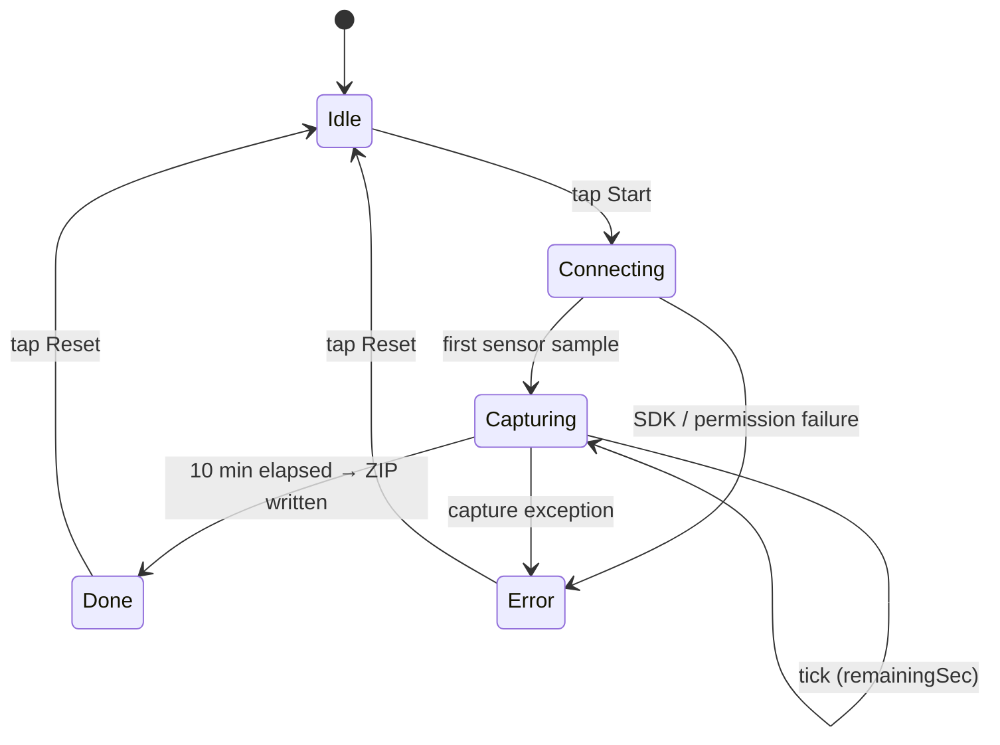

상태 전이는 [`CaptureActivity.kt`의 `Status` sealed class](watch/sensor-capture/app/src/main/kotlin/com/littlesignals/capture/CaptureActivity.kt)에 정의되어 있고, `capture { remaining -> ... }` 람다가 매 초 `Capturing(remainingSec)` 상태를 갱신합니다. 성공 시 ZIP 경로를 반환하며 `Done`으로 전이하고, 임의의 throwable은 `Error(message)`로 잡힙니다.

### 3.1 캡처 채널

| 채널 | Samsung 트래커 | 관측 샘플레이트 | 모델 용도 |
|---|---|---|---|
| Heart rate + IBI | `HEART_RATE_CONTINUOUS` | ~1 Hz (event-driven) | HRV — 스트레스 모델의 근간 |
| PPG green | `PPG_GREEN` | ~25 Hz | 원시 광학 신호, 모델 입력 |
| EDA | `EDA_CONTINUOUS` | ~25 Hz | 피부 전도도, 두 번째 핵심 신호 |
| Accelerometer | `ACCELEROMETER_CONTINUOUS` | ~25–50 Hz | 모션 아티팩트 필터 / 활동 게이팅 |

피부 온도는 의도적으로 제외되었습니다. 저빈도 사이클 컨텍스트일 뿐 스트레스 모델 입력이 아닙니다.

### 3.2 SDK 검증 결과 (2026-05-04)

Samsung Health Sensor SDK 1.4.1 (`samsung-health-sensor-api-1.4.1.aar`)을 직접 검수하여, `HealthTrackerType` 열거형으로 다음이 노출됨을 확인했습니다.

```kotlin
ValueKey.HeartRateSet.HEART_RATE          // BPM
ValueKey.HeartRateSet.IBI_LIST            // HRV 입력
ValueKey.PpgGreenSet.PPG_GREEN            // 원시 PPG 샘플
ValueKey.EdaSet.SKIN_CONDUCTANCE          // EDA 값
ValueKey.AccelerometerSet.ACCELEROMETER_X // x/y/z 동일
```

v1 모델이 필요로 하는 4개 채널(연속 PPG, 심박+IBI, 연속 EDA, 연속 가속도)이 모두 연속 이벤트 스트림으로 제공됨을 실제 워치에서 검증 완료했습니다. 일부 상수명은 SDK 마이너 버전에 따라 변동(`HEART_RATE` ↔ `HEART_RATE_VALUE`, `RESISTANCE` ↔ `SCL` 등)되므로, IDE 자동완성으로 매칭되는 상수를 선택해 `ChannelRecorder.kt`에 반영합니다. 채널 계약(BPM/IBI 리스트/상태 코드/x·y·z)은 안정적이며 필드명만 달라집니다.

### 3.3 출력 레이아웃

10분 캡처가 성공하면 워치의 다음 경로에 결과가 생성됩니다.

```
/data/data/com.littlesignals.capture/files/captures/
├── 2026-05-06T15-30-00Z/
│   ├── heart_rate.csv          timestamp_ms, hr_bpm, ibi_ms, hr_status
│   ├── ppg_green.csv           timestamp_ms, ppg_green, status
│   ├── eda.csv                 timestamp_ms, resistance_kohm, status
│   ├── accel.csv               timestamp_ms, x, y, z
│   └── metadata.json           start/end ts, watch model, observed sample rates
└── 2026-05-06T15-30-00Z.zip    # ML 팀에 전달하는 단일 산출물
```

`timestamp_ms`는 SDK의 `DataPoint.timestamp` (벽시계 UTC ms).

### 3.4 빌드와 실행

요구사항: Android Studio (Iguana / Koala 이상), 개발자 모드가 활성화되어 `adb devices`에 노출되는 Galaxy Watch 8, 저장소에 포함된 `libs/samsung-health-sensor-api-1.4.1.aar`.

```bash
cd watch/sensor-capture
gradle wrapper --gradle-version 8.11.1
./gradlew :app:assembleDebug
./gradlew :app:installDebug
adb shell am start -n com.littlesignals.capture/.CaptureActivity
```

워치를 80% 이상 충전 후, **첫 2분은 정자세**, 이후 8분은 일상 활동(보행, 타이핑, 기립·착석 등)으로 진행하면 휴식·동작 구간 모두 포함된 데이터가 만들어집니다.

### 3.5 데이터 추출

```bash
SESSION="2026-05-06T15-30-00Z"
adb exec-out run-as com.littlesignals.capture cat \
  files/captures/${SESSION}.zip > ${SESSION}.zip

unzip -l ${SESSION}.zip
unzip -p ${SESSION}.zip metadata.json | jq .
unzip -p ${SESSION}.zip ppg_green.csv | wc -l   # 10분 ≈ 15,000 행
```

루팅되지 않은 워치에서는 `adb pull /data/data/...`가 실패하므로, 디버그 빌드의 `run-as ... cat` 패턴이 표준입니다. 행이 0이거나 값이 전부 0/-1이면 권한 거부 또는 착용 불량을 의심하고 `adb logcat | grep -i capture`로 확인 후 재시도합니다.

자세한 설치·검증·재사용 가이드는 [`watch/sensor-capture/README.md`](watch/sensor-capture/README.md).

---

## 4. Frontend — Flutter Android App

### 4.1 Frontend 개요

`frontend/`는 Luma의 Flutter 기반 Android 모바일 애플리케이션입니다. 사용자가 직접 만나는 presentation layer로서 스트레스 기록, 생리 주기 맥락 기반 인사이트, 수면 데이터 화면, 주간 리포트, 알림 등록, 원시 생체신호 캡처 UX를 담당합니다.

앱은 staging FastAPI backend와 REST API로 통신하며, 화면 상태는 Provider 기반으로 관리됩니다. 사용자는 Auth 화면에서 진입한 뒤 Home dashboard를 중심으로 스트레스 기록, My Cycle, Sleep Data, Insight, Profile, Watch/Biosignal Capture 화면을 오갑니다. UI copy는 한국어 사용 맥락에 맞춰 부드럽고 부담이 적은 tone을 유지합니다.

### 4.2 설계 목표

Frontend는 사용자의 기록 부담을 낮추고, 민감한 건강 맥락을 조심스럽게 다루는 것을 목표로 설계되었습니다.

1. **빠른 stress logging UX**
   사용자는 Home 또는 기록 목록에서 스트레스 강도, 요인, 메모를 빠르게 남기고 수정할 수 있습니다. 저장된 기록은 provider refresh를 통해 Home, Insight, Report 화면에 반영됩니다.

2. **Cycle-aware insight visualization**
   스트레스 기록은 생리 주기 정보와 함께 해석됩니다. Home의 cycle card, My Cycle auto-save, Insight calendar, report UI는 사용자가 주기 단계와 스트레스 패턴을 함께 볼 수 있도록 구성되어 있습니다.

3. **Staging backend 기반 실사용 flow**
   Auth, profile, events, cycles, categories, consent, sleep logs, weekly reports, device token registration, biosignal sync metadata가 staging API client layer를 통해 호출됩니다.

4. **Biosignal capture/upload UX**
   Watch/Biosignal 화면은 raw biosignal consent, capture source 선택, duration 선택, live status, upload window count, summary screen을 제공합니다. Flutter UI는 Android native capture layer와 MethodChannel/EventChannel로 연결됩니다.

5. **Korean UI copy 중심의 interaction**
   nickname, trigger, cycle, sleep, notification, privacy copy는 한국어 서비스 tone에 맞춰 정리되어 있으며, 사용자-facing label과 backend/raw data를 분리하는 formatter를 사용합니다.

### 4.3 기술 스택

| 영역 | 기술 |
| :--- | :--- |
| App framework | Flutter / Dart |
| State management | Provider |
| Backend communication | REST API client layer |
| Auth frontend flow | Anonymous auth, Google Sign-In frontend flow |
| Push registration | Firebase Messaging / FCM device token registration |
| Native bridge | MethodChannel / EventChannel |
| Android native integration | Kotlin, Android foreground service |
| Wear communication boundary | Wear Data Layer |
| Android package | `com.littlesignals.app` |
| Testing | Flutter tests, regression smoke tests, Android/Kotlin unit tests |

사용자-facing branding은 `Luma`입니다. Android package와 일부 runtime env key는 현재 빌드 및 배포 호환성을 위해 `com.littlesignals.app`, `LITTLESIGNALS_GOOGLE_SERVER_CLIENT_ID` 이름을 사용합니다.

### 4.4 구현된 주요 기능

현재 frontend에는 다음 사용자 흐름과 integration이 구현되어 있습니다.

* Auth landing
* Anonymous auth
* Google Sign-In frontend request flow
* Home dashboard
* Stress log create/edit
* Trigger/category management
* Cycle current/history/create/update flow
* My Cycle auto-save UX
* Sleep log display states
* Insight calendar / report UI
* AI weekly report card/detail UI
* Profile / nickname editing
* Notification permission handling
* FCM device token registration
* Watch / biosignal capture UI
* Raw biosignal consent toggle
* Capture source picker
* Capture status / summary screen
* Session cleanup/provider reset
* Korean UI copy polish
* Regression smoke tests

### 4.5 Architecture 요약

Frontend는 shared core layer, feature layer, screen layer, native capture layer로 나뉩니다.

* `lib/core/`는 app-wide foundation입니다. API base URL, shared `ApiClient`, secure token storage, theme, spacing, shared widgets, Korean UI formatter를 포함합니다.
* `lib/features/`는 domain별 provider, model, service, API adapter를 포함합니다. Auth, Events, Cycles, Sleep, Triggers, Insight, Consent, Notifications, Privacy, Biosignals가 이 계층에 있습니다.
* `lib/screens/`는 실제 화면 composition을 담당합니다. Home, Insight, My/Profile, Stress Log, My Cycle, Sleep Data, Watch/Biosignal Capture 화면이 Provider state를 소비합니다.
* Provider는 화면 상태와 사용자 action을 조율합니다. 예를 들어 `EventsProvider`는 stress event create/edit flow를 관리하고, `CycleProvider`는 cycle save/update와 My Cycle auto-save를 담당하며, `InsightProvider`는 event/cycle data와 weekly report를 조합합니다.
* `features/*/data` API layer는 backend endpoint와 JSON mapping을 캡슐화합니다. UI는 HTTP path나 backend response shape를 직접 다루지 않고 provider를 통해 domain state를 읽습니다.
* Native capture layer는 `features/biosignals/`의 Flutter bridge와 `android/app/src/main/kotlin/com/littlesignals/app/capture/`의 Android service/controller/uploader로 구성됩니다. Flutter는 capture command와 status stream을 다루고, Android는 foreground capture session, Wear Data Layer messaging, sample buffering, upload window 생성, presigned S3 PUT upload를 처리합니다.

### 4.6 사용자 흐름

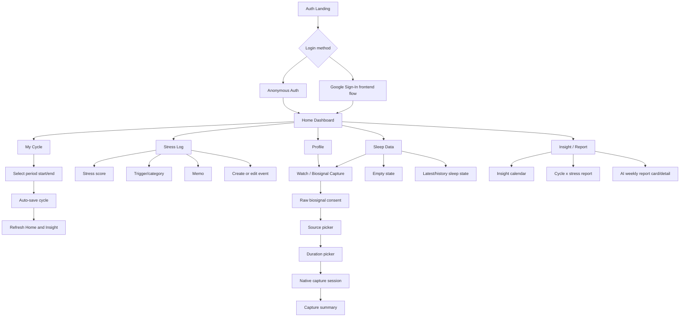

### 4.7 Frontend Data Flow

```mermaid
flowchart LR
    UI["Flutter UI<br/>screens"] --> Provider["Provider state<br/>Auth, Events, Cycle, Sleep, Insight, Triggers"]
    Provider --> DataAPI["Feature data API<br/>features/*/data"]
    DataAPI --> ApiClient["Shared ApiClient<br/>token refresh, request id, JSON mapping"]
    ApiClient --> Backend["FastAPI staging backend"]
    Backend --> ApiClient
    ApiClient --> DataAPI
    DataAPI --> Provider
    Provider --> UI

    UI --> CaptureController["BiosignalCaptureController"]
    CaptureController --> Channels["MethodChannel / EventChannel"]
    Channels --> ForegroundService["Android foreground service"]
    ForegroundService --> Source{"Capture source"}
    Source --> Wear["Wear Data Layer"]
    Source --> Synthetic["SyntheticSampleSource"]
    Wear --> Receiver["WatchSampleReceiver"]
    Receiver --> WatchBuffer["WatchSourceController"]
    Synthetic --> Uploader["WindowUploader"]
    WatchBuffer --> Uploader
    Uploader --> Batch["POST /api/v1/sync/biosignals/batch"]
    Batch --> Backend
    Backend --> Presigned["Presigned S3 PUT URL"]
    Presigned --> S3["S3 raw biosignal object"]
```

### 4.8 Backend Integration

Frontend는 staging backend와 다음 API 흐름을 사용합니다.

| 기능 | API |
| :--- | :--- |
| User profile | `GET /api/v1/me`, `PATCH /api/v1/me` |
| Stress events | `GET /api/v1/events`, `POST /api/v1/events`, `PATCH /api/v1/events/{id}`, `DELETE /api/v1/events/{id}` |
| Cycle | `GET /api/v1/cycles/current`, `GET /api/v1/cycles/history`, `POST /api/v1/cycles/period-start`, `PATCH /api/v1/cycles/{id}` |
| Trigger/category | `GET /api/v1/categories`, `POST /api/v1/categories`, `PATCH /api/v1/categories/{id}`, `DELETE /api/v1/categories/{id}` |
| Consent | `GET /api/v1/consent`, `PATCH /api/v1/consent` |
| Sleep logs | `GET /api/v1/sleep-logs/latest`, `GET /api/v1/sleep-logs`, `POST /api/v1/sleep-logs`, `PATCH /api/v1/sleep-logs/{id}`, `DELETE /api/v1/sleep-logs/{id}` |
| Device token | `POST /api/v1/devices/fcm-token` |
| Weekly report | `GET /api/v1/reports/weekly` |
| Raw biosignal sync | `POST /api/v1/sync/biosignals/batch`, presigned S3 `PUT` upload flow |

Stress, cycle, sleep, trigger, profile, consent, report data는 feature별 API adapter에서 domain model로 변환된 뒤 Provider를 통해 화면에 전달됩니다. Raw biosignal upload는 Android native `WindowUploader`가 batch metadata를 backend에 등록하고, backend가 반환한 presigned S3 PUT URL로 채널별 payload를 업로드하는 구조입니다.

### 4.9 Native Capture Integration

Watch/Biosignal capture 화면은 phone-side raw biosignal capture/upload infrastructure와 연결되어 있습니다.

* Flutter `BiosignalCaptureService`는 `MethodChannel('littlesignals/capture')`로 `start`, `stop`, `isWatchConnected` command를 호출합니다.
* Flutter `BiosignalCaptureService`는 `EventChannel('littlesignals/capture/status')`로 capture state, elapsed seconds, uploaded window count, error state를 수신합니다.
* Android `CaptureChannels`는 Flutter method/event channel을 등록하고, `BiosignalCaptureService` foreground service를 시작합니다.
* Android foreground service는 timed/manual capture session을 실행하고 notification으로 capture 상태를 유지합니다.
* `WearMessageClient`는 Wear Data Layer reachable node/capability를 확인하고 `/biosignals/start`, `/biosignals/stop` message를 보냅니다.
* `WatchSampleReceiver`는 `/biosignals/samples`, `/biosignals/end` message를 수신합니다.
* `WatchSourceController`는 HR, PPG, EDA, accelerometer sample batch를 buffer에 모읍니다.
* `SyntheticSampleSource`는 capture/upload plumbing을 확인할 수 있는 synthetic sample source를 제공합니다.
* `WindowUploader`는 1분 단위 window를 만들고 `hrv`, `ppg`, `eda`, `accel` payload를 backend batch registration 및 presigned S3 PUT upload flow로 보냅니다.
* Capture session이 끝나면 Flutter는 elapsed time, uploaded window count, estimated data size를 summary screen에 표시합니다.

이 섹션의 범위는 wearable-oriented raw biosignal capture/upload infrastructure이며, app의 stress/cycle/sleep 기록 UX와 병렬로 동작하는 capture/upload 경로를 다룹니다.

### 4.10 Notification Flow

앱은 Firebase Messaging을 사용해 알림 권한과 device token registration을 처리합니다.

* Authenticated session load 시 `NotificationService.requestPermissionAndRegister()`가 호출됩니다.
* Firebase Messaging permission prompt 결과를 확인한 뒤 FCM token을 가져옵니다.
* token이 존재하면 `NotificationsApi.registerDeviceToken()`이 `/api/v1/devices/fcm-token`으로 `token`, `platform: android`를 전송합니다.
* Notification copy는 OS locale에 맞춰 Korean/English text를 제공하며, 권한 안내와 fallback notification 문구를 분리해 관리합니다.

### 4.11 Frontend 실행과 테스트

```bash
cd frontend
flutter pub get
flutter analyze
flutter test
flutter run
```

Google OAuth web client ID를 명시적으로 지정할 때는 다음 runtime define을 사용합니다.

```bash
flutter run --dart-define=LITTLESIGNALS_GOOGLE_SERVER_CLIENT_ID=YOUR_WEB_CLIENT_ID
```

사용자-facing branding은 `Luma`이며, Android package와 Google OAuth runtime define은 `com.littlesignals.app`, `LITTLESIGNALS_GOOGLE_SERVER_CLIENT_ID` 이름을 사용합니다.

Regression smoke tests는 auth navigation, anonymous auth, main tabs, Home dashboard, stress log create/edit, trigger management, cycle auto-save, sleep display states, notification copy, nickname/session cleanup, provider reset 흐름을 검증합니다. Android/Kotlin unit tests는 `SyntheticSampleSource`, `WindowUploader`, `WearMessageClient`, `WatchSourceController`의 capture layer behavior를 검증합니다.


## 5. 아키텍처 전체 흐름 (요약)

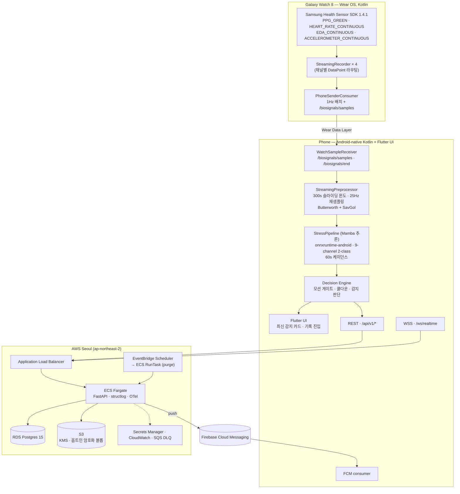

---

## 6. 문서

내부 검토자(평가위원·심사자·신규 합류자)는 다음 순서로 읽으면 됩니다.

| # | 문서 | 다루는 범위 |
| :---: | :--- | :--- |
| 1 | 본 README §2.1–§2.5 | 백엔드 설계 원칙·기술 스택·인프라·데이터 모델·API 요약 |
| 2 | [`backend/README.md`](backend/README.md) | 모듈별(라우터/서비스/스키마/관측성) 상세 |
| 3 | [`backend/infra/README.md`](backend/infra/README.md) | Terraform 모듈 구성, 변수, 배포 절차 |
| 4 | [`backend/docs/sprint-7-deploy-runbook.md`](backend/docs/sprint-7-deploy-runbook.md) | EventBridge + ECS RunTask 이관, `audit_log` 도입 런북 |
| 5 | [`watch/sensor-capture/README.md`](watch/sensor-capture/README.md) | Wear OS 4채널 캡처 도구 사용·검증 |
| 6 | [`CONTRIBUTING.md`](CONTRIBUTING.md) | 브랜치 규칙·PR 워크플로우·보안 영역 추가 승인 |

내부 전체 스펙(공개 저장소에 포함하지 않는 부분)이 필요한 경우 §6 팀 연락처로 요청해 주세요.

---

## 7. 팀 소개

<table>
  <tr>
    <td align="center" width="160">
      <a href="https://github.com/nukktae">
        <br/>
        <sub><b>아노</b></sub>
      </a><br/>
      <sub><b>팀장</b> · Backend / Infra / Wear OS / AI 통합</sub><br/>
      <sub><a href="mailto:anu.bnda@gmail.com">anu.bnda@gmail.com</a></sub>
    </td>
    <td align="center" width="160">
      <a href="https://github.com/joonseojj">
        <br/>
        <sub><b>윤준서</b></sub>
        </a><br/>
        <sub>Data / AI</sub><br/>
        <sub><a href="mailto:joonseojj@gmail.com">joonseojj@gmail.com</a></sub>
      </a><br/> 
    </td>
    <td align="center" width="160">
      <a href="https://github.com/pnpn777">
        <br/>
        <sub><b>예르잔 울판</b></sub>
      </a><br/>
      <sub>Frontend / UX /UI Design</sub>
       <sub><a href="mailto:yerzhanulpan@kookmin.ac.kr">yerzhanulpan@kookmin.ac.kr</a></sub>
    </td>
    <td align="center" width="160">
      <a href="https://github.com/seennothing">
        <br/>
        <sub><b>초라핀스카 베로니카</b></sub>
      </a><br/>
      <sub>Data / AI Engineer</sub><br/>
      <sub><a href="mailto:czorapinska@kookmin.ac.kr">czorapinska@kookmin.ac.kr</a></sub>
    </td>
  </tr>
</table>

| 이름 | 역할 | 담당 영역 | 연락처 |
| :--- | :--- | :--- | :--- |
| 아노 (nukktae) | 팀장 · Backend Engineer | • Backend 아키텍처 설계·구현 (FastAPI 0.136 + asyncio, SQLAlchemy 2.0/asyncpg, Alembic, Pydantic v2, Supabase JWT 인증, FCM 푸시, structlog/OTel 관측성, 9개 스프린트 운영)<br>• AWS 클라우드 인프라(ECS Fargate, RDS Postgres 15, ALB, S3, EventBridge, Terraform)<br>• Agentic AI 파이프라인 설계·운영<br>• Wear OS — Galaxy Watch 8 센서 캡처 도구(Kotlin, Samsung Health Sensor SDK 1.4.1) 구현 및 PPG/HRV/EDA/가속도 4채널 검증<br>• UX 설계 및 사용자 흐름<br>• Frontend ↔ Backend ↔ ONNX 온디바이스 추론 간 종단 연동(REST/WebSocket/FCM, 모델 직렬화·배포 파이프라인)<br>• 랜딩 페이지 디자인 및 개발<br>• Blender 기반 3D 렌더링 | <anu.bnda@gmail.com> · [LinkedIn](https://www.linkedin.com/in/anu-bilegdemberel-445366318/) |
| 예르잔 울판 (pnpn777) | Frontend / UX-UI Engineer | • Flutter frontend architecture <br>•  Korean UX copy 및 interaction flow 설계<br>• UX research 및 여성 스트레스·생리 주기 기반 사용자 흐름 설계<br>• MVP 범위 정의 및 feature prioritization<br>• Home / Insight / Profile UX 및 visual hierarchy 설계<br>• Figma 기반 mobile UI design system 및 component flow 정리 | <yerzhanulpan@kookmin.ac.kr> |
| 윤준서 (joonseojj) | Data / AI Engineer | • WESAD 전처리 파이프라인 구현 및 반복 개선 (피처 확장, 정규화 방식 고도화)<br>• 데이터셋 적합성 분석<br>• 여성 스트레스 데이터셋 후보 7개 검토, WESAD·WorkStress3D 선정 및 전처리 파이프라인 구현<br>• 9채널 실시간 피처 구조 설계 및 SW팀 연동 명세서 작성 <br>• 여성 대상 프로젝트 계획서/보고서 작성 | <joonseojj@gmail.com> |
| 초라핀스카 베로니카 (seennothing) | Data / AI Engineer | • 데이터셋 조사<br>• 데이터 전처리 및 데이터셋 통합<br>• 모델 학습 및 최적화<br>• 모델 성능 검증<br>• UX 중심 결과 필터링 실험 (false positive 제거 목적)<br>• ONNX export 및 SW team handoff | <czorapinska@kookmin.ac.kr> |

전체 기여자 그래프: <https://github.com/kookmin-sw/2026-capstone-18/graphs/contributors>

---

## 8. 시연 영상

<p align="center">
  <video src="https://github.com/user-attachments/assets/9077115f-dcfc-4898-a309-afc126edbf79" controls muted playsinline width="320"></video>
</p>

> 🔊 소리를 켜고 보세요.

### 주요 화면

<table>
  <tr>
    <td align="center" width="20%">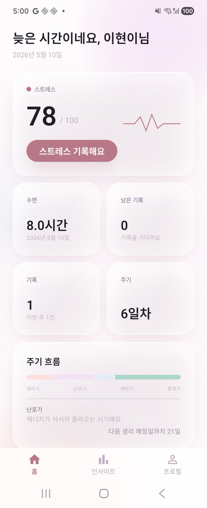<br/><sub><b>홈</b><br/>실시간 스트레스·수면·주기</sub></td>
    <td align="center" width="20%">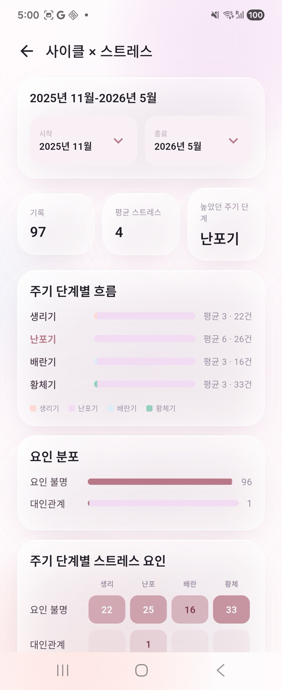<br/><sub><b>인사이트</b><br/>주기 단계별 스트레스 흐름</sub></td>
    <td align="center" width="20%">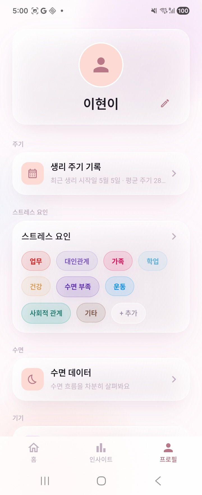<br/><sub><b>프로필</b><br/>스트레스 요인 태그 관리</sub></td>
    <td align="center" width="20%">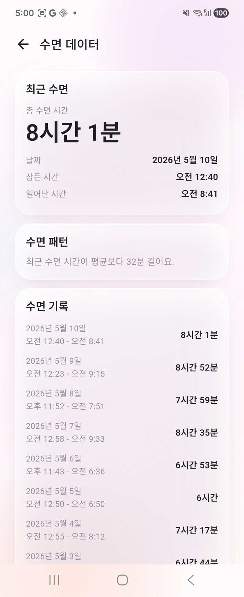<br/><sub><b>수면</b><br/>일별 수면 시간 추이</sub></td>
    <td align="center" width="20%">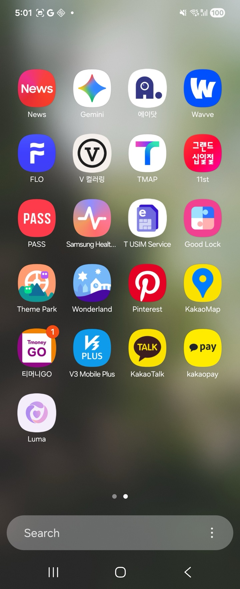<br/><sub><b>런처</b><br/>Galaxy 런처에 설치된 Luma</sub></td>
  </tr>
</table>

---

## 기여 가이드

`master`에 직접 푸시하지 않고 PR-only 워크플로우로 운영합니다. 브랜치 prefix(`feat/`, `fix/`, `docs/`, `chore/`, `refactor/`, `test/`, `infra/`), Conventional Commits 메시지, PR 체크리스트, 보안 영역 추가 승인 규칙은 [`CONTRIBUTING.md`](CONTRIBUTING.md)를 참고하세요.

---

## 라이선스

본 저장소는 [MIT 라이선스](LICENSE) 하에 배포됩니다.

다음 구성 요소는 별도 라이선스가 적용되며 MIT 적용 범위에서 제외됩니다.

- Samsung Health Sensor SDK (`watch/sensor-capture/libs/samsung-health-sensor-api-1.4.1.aar`) — Samsung Health SDK License Agreement
- WESAD / Stress-Predict 데이터셋 — 원본 연구용 라이선스 (자세한 내용은 `AI/src/dataset/`)
