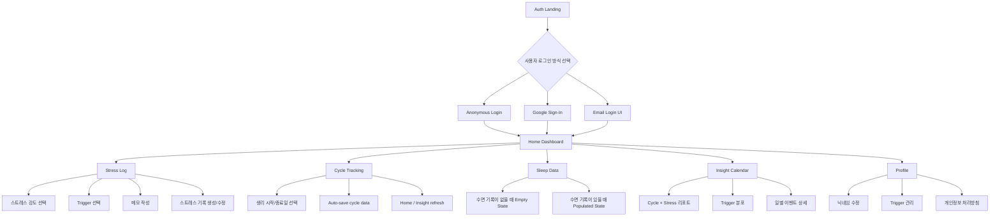
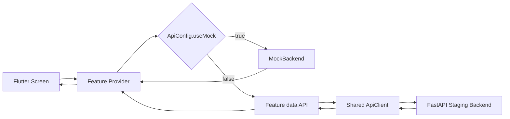
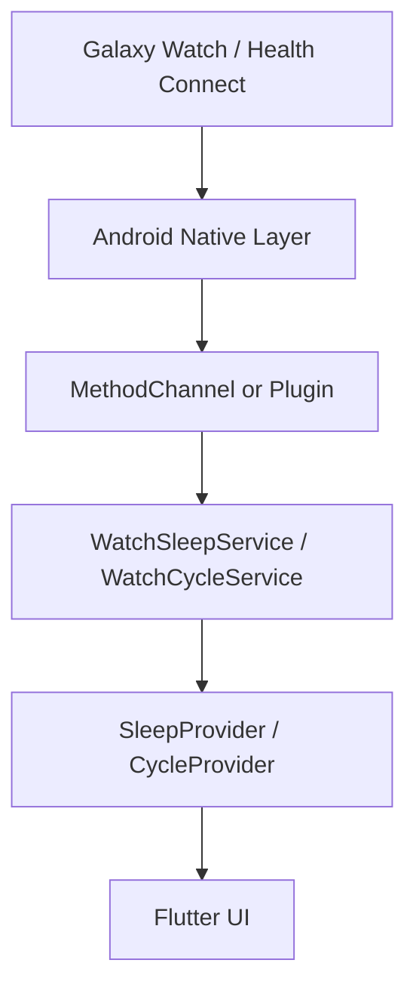
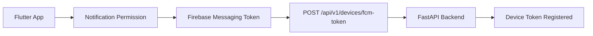

# Little Signals — 2026 Capstone 18

[](https://github.com/kookmin-sw/2026-capstone-18/commits/master)
[](https://github.com/kookmin-sw/2026-capstone-18/commits/master)
[](https://github.com/kookmin-sw/2026-capstone-18/pulse)
[](https://github.com/kookmin-sw/2026-capstone-18/graphs/contributors)
[](LICENSE)
[](https://github.com/kookmin-sw/2026-capstone-18/stargazers)

여성 사용자를 위한 실시간 스트레스 탐지 및 생리 주기 추적 애플리케이션. Galaxy Watch 8에서 수집한 원시 생체신호(PPG, HRV, EDA, 가속도)를 기반으로 온디바이스(Mamba) 추론을 수행하고, 사전 스트레스(Pre-Stress) 단계에서 손목 호흡 가이드를 제시합니다. 백엔드는 AWS Seoul(ap-northeast-2)에 배포되며 한국 PIPA를 전제로 설계되었습니다.

- **팀**: 국민대학교 2026 캡스톤 18조
- **팀페이지**: <https://kookmin-sw.github.io/2026-capstone-18/>
- **타깃 플랫폼**: Galaxy Watch 8 (Wear OS) + Android (Flutter)
- **배포 리전**: AWS Seoul (`ap-northeast-2`)

### 기술 스택

**Backend**


**Cloud / Infra**


**AI / ML**


**Frontend / Watch**


**Quality / Tooling**


---

## 목차

- [저장소 구조](#저장소-구조)
- [선행 요구사항](#선행-요구사항)
- [1. AI — 사전 스트레스 예측 (Mamba)](#1-ai--사전-스트레스-예측-mamba)
  - [1.1 주요 기술 결정](#11-주요-기술-결정)
  - [1.2 9-채널 입력 텐서 매핑](#12-9-채널-입력-텐서-매핑)
  - [1.3 빠른 시작](#13-빠른-시작)
- [2. Backend — FastAPI on AWS Seoul](#2-backend--fastapi-on-aws-seoul)
  - [2.1 설계 원칙](#21-설계-원칙)
  - [2.2 기술 스택](#22-기술-스택)
  - [2.3 인프라 (Terraform)](#23-인프라-terraform)
  - [2.4 데이터 모델 (요약)](#24-데이터-모델-요약)
  - [2.5 API 요약](#25-api-요약)
  - [2.6 스프린트 진행 현황](#26-스프린트-진행-현황)
  - [2.7 로컬 개발](#27-로컬-개발)
  - [2.8 스테이징 배포](#28-스테이징-배포)
- [3. Wear OS — Galaxy Watch 8 센서 캡처](#3-wear-os--galaxy-watch-8-센서-캡처)
  - [3.1 캡처 채널](#31-캡처-채널)
  - [3.2 SDK 검증 결과 (2026-05-04)](#32-sdk-검증-결과-2026-05-04)
  - [3.3 출력 레이아웃](#33-출력-레이아웃)
  - [3.4 빌드와 실행](#34-빌드와-실행)
  - [3.5 데이터 추출](#35-데이터-추출)
- [4. Frontend — Flutter Android App](#4-frontend--flutter-android-app)
  - [4.1 설계 목표](#41-설계-목표)
  - [4.2 기술 스택](#42-기술-스택)
  - [4.3 주요 사용자 흐름](#43-주요-사용자-흐름)
  - [4.4 구현 완료 기능](#44-구현-완료-기능)
  - [4.5 Frontend 아키텍처](#45-frontend-아키텍처)
  - [4.6 Frontend Data Flow](#46-frontend-data-flow)
  - [4.7 Backend Integration Status](#47-backend-integration-status)
  - [4.8 Watch / Sleep / Cycle Integration Contract](#48-watch--sleep--cycle-integration-contract)
  - [4.9 Notification Flow](#49-notification-flow)
  - [4.10 Frontend 실행](#410-frontend-실행)
  - [4.11 테스트](#411-테스트)
- [5. 아키텍처 전체 흐름 (요약)](#4-아키텍처-전체-흐름-요약)
- [6. 문서](#5-문서)
- [7. 팀 소개](#6-팀-소개)
- [8. 시연 영상](#7-시연-영상)
- [기여 가이드](#기여-가이드)
- [라이선스](#라이선스)

---

## 저장소 구조

```text
2026-capstone-18/
├── AI/                       # 사전 스트레스 예측 Mamba 파이프라인 (학습/평가)
│   ├── notebooks/
│   └── src/
│       ├── dataset/          # WESAD / Stress-Predict 다운로드·전처리
│       ├── mamba_model.py    # Pure PyTorch Mamba 아키텍처
│       ├── train.py          # 5-Fold GroupKFold 학습 루프
│       ├── train_LOSO.py     # Leave-One-Subject-Out 검증
│       └── train_fp_fold1.py # 단일 fold full-precision 학습
├── backend/                  # FastAPI 백엔드 + Terraform 인프라
│   ├── app/                  # 라우터·서비스·모델·스키마·관측성
│   ├── alembic/              # DB 마이그레이션
│   ├── infra/                # Terraform (ECS, RDS, ALB, S3, EventBridge)
│   ├── scripts/              # 부트스트랩·마이그레이션·스모크 테스트
│   └── docs/                 # 스프린트별 배포 런북
├── watch/
│   └── sensor-capture/       # Wear OS 원시 센서 수집 유틸 (Kotlin)
├── README.md
└── index.md                  # GitHub Pages 진입점
```

---

## 선행 요구사항

전체 시스템(AI 학습 → 백엔드 → Watch → Flutter 앱)을 로컬·스테이징에서 구동하려면 다음 계정·도구·하드웨어가 필요합니다. 각 영역만 단독으로 실행할 때 필요한 항목은 하단 "필수 영역" 열을 참고하세요.

| 분류 | 항목 | 용도 | 필수 영역 | 비용 (베타 코호트 기준) |
| :--- | :--- | :--- | :--- | :--- |
| 클라우드 | **AWS 계정 (Seoul `ap-northeast-2`)** | ECS Fargate, RDS Postgres 15, ALB, S3, EventBridge, Secrets Manager, CloudWatch, SQS, ECR, Route53, ACM | Backend 배포 | Free Tier + 소액 사용량 |
| 인증 | **Supabase 프로젝트** | JWT 발급, 익명 사용자, Google OAuth 교환 | Backend, Frontend | Free Tier |
| 푸시 | **Firebase 프로젝트** | Cloud Messaging(FCM) 토큰 등록 + 백그라운드 푸시 | Backend, Frontend | Free |
| OAuth | **Google Cloud 프로젝트** (OAuth 클라이언트) | Supabase Auth와 연동되는 Google 로그인 | Frontend | Free |
| 도메인 | 사용자 소유 도메인 1개 | 스테이징 ACM/Route53 (`api-staging.<도메인>`) | Backend 배포 | 기존 도메인 재사용 |
| CI/CD | **GitHub** (조직 권한) | GitHub Actions로 ECR 푸시·Terraform plan·마이그레이션 실행 | 전 영역 | Public 저장소 무료 |
| 로컬 도구 | Python 3.12 (pyenv), Poetry 2.x, Docker Desktop, `psql`, `jq` | 백엔드 로컬 개발/테스트 | Backend | — |
| 로컬 도구 | Terraform 1.7+, AWS CLI v2 | 인프라 프로비저닝 | Backend 배포 | — |
| 로컬 도구 | Flutter SDK (stable), Android Studio Iguana 이상, Android SDK 34+ | Phone 앱 빌드 | Frontend | — |
| 로컬 도구 | Android Studio + Wear OS 에뮬레이터/실기기, `adb` | Watch 캡처 도구 빌드 | Watch | — |
| 하드웨어 | **Galaxy Watch 8** (개발자 모드, 80% 이상 충전) | 4채널 원시 센서 캡처, 온디바이스 추론 | Watch | — |
| 하드웨어 | Android 폰 (Galaxy Z Flip 5 등) | Flutter 앱 실기기 테스트 | Frontend | — |
| SDK | Samsung Health Sensor SDK 1.4.1 (`samsung-health-sensor-api-1.4.1.aar`) | Watch 센서 채널 접근 | Watch | 저장소에 포함 |

각 도구의 정확한 버전 핀은 `backend/pyproject.toml`, `backend/infra/versions.tf`, `frontend/pubspec.yaml`, `watch/sensor-capture/build.gradle.kts`에서 확인합니다.

---

## 1. AI — 사전 스트레스 예측 (Mamba)

WESAD 데이터셋을 활용하여 사전 스트레스(Pre-Stress)를 예측하기 위해 최적화된 시계열 분류(TSC) Mamba 파이프라인입니다. v2.2 아키텍처는 명시적 수학적 피처 주입과 간소화된 3-Class 상태 머신을 채택하여, 엣지 환경(ESP32-S3, Wear OS)에서의 INT8 양자화와 효율적인 추론을 목적으로 설계되었습니다.

### 1.1 주요 기술 결정

- **9-채널 명시적 피처 주입(Explicit Feature Injection)**: 모델이 고주파 노이즈로부터 거시적 추세를 강제로 학습하도록 두지 않고, 인과적 EMA(Causal EMA), MACD Delta 기울기, 후행 노이즈 분산(Trailing Variance)을 입력 텐서에 직접 주입.
- **배포 지향적 3-Class 시스템**: 노이즈가 큰 5-Class WESAD 프로토콜을 견고한 3-Class 시스템(`0: Baseline`, `1: Pre-Stress`, `2: Stress`)으로 통합. 사후 회복(Cooldown)과 즐거움(Amusement)은 INT8 양자화 경계를 보존하기 위해 알고리즘적으로 Baseline에 매핑.
- **Causal MACD 동적 라벨링**: 9초 Temporal Debouncing이 적용된 인과적 15분 Lookback 알고리즘으로 생리학적 각성의 시작점을 수학적으로 특정.
- **전역 가속도 스케일링(Global ACC Scaling)**: 피험자별 Z-Score를 제거하고 1g(64.0) 휴식 기준의 전역 스케일(`-3.0` ~ `+3.0`)을 적용하여 INT8 양자화 시 스케일 스트레칭을 방지.
- **Pure PyTorch Mamba**: 제한된 엣지 환경에서의 호환성을 위해 `mamba-ssm` 패키지 의존성 없이 순수 PyTorch로 구현.

### 1.2 9-채널 입력 텐서 매핑

추론 시 입력 텐서의 인덱스 순서를 정확히 준수해야 합니다. **피부 온도(TEMP)는 사용하지 않으며, EDA/GSR은 반드시 포함되어야 합니다.**

| 인덱스 | 피처명 | 설명 | 대상 하드웨어 |
| :---: | :--- | :--- | :--- |
| **0** | `bvp_calib` | 고주파 원본 BVP (PPG) 신호 | Galaxy Watch 8 PPG Green |
| **1** | `eda_calib` | 절대 피부 전도도 (Z-Score) | Galaxy Watch 8 EDA |
| **2** | `acc_mag_global` | 전역 물리적 활동량 (고정 스케일) | Galaxy Watch 8 Accelerometer |
| **3** | `eda_ema_context` | 5분 Causal EMA (EDA 거시 추세) | *(소프트웨어 연산)* |
| **4** | `bvp_ema_context` | 5분 Causal EMA (BVP 거시 추세) | *(소프트웨어 연산)* |
| **5** | `eda_macd_delta` | EDA Phasic 파생 변수 | *(소프트웨어 연산)* |
| **6** | `bvp_macd_delta` | BVP Phasic 파생 변수 | *(소프트웨어 연산)* |
| **7** | `norm_std_eda` | 후행 EDA 노이즈 플로어 (Variance) | *(소프트웨어 연산)* |
| **8** | `norm_std_bvp` | 후행 BVP 노이즈 플로어 (Variance) | *(소프트웨어 연산)* |

### 1.3 빠른 시작

```bash
cd AI
pip install -r requirements.txt

# 1) WESAD 데이터셋 자동 다운로드
python src/dataset/download_wesad.py

# 2) 9-채널 / 3-Class 전처리 파이프라인
python src/dataset/preprocess_wesad.py

# 3) GroupKFold 학습 (피험자 간 데이터 누수 방지)
python src/train.py --epochs 50 --batch_size 64

# 4) 평가 및 시각화
jupyter notebook notebooks/eval_scripts.ipynb
```

학습이 중단된 경우 `--resume` 플래그로 안전하게 재개할 수 있습니다.

---

## 2. Backend — FastAPI on AWS Seoul

100명 규모 베타 코호트를 대상으로 인증, 데이터 영속화, Watch–Phone 실시간 동기화, 옵트인 암호화 생체신호 보관, 감사 로그를 제공하는 서비스입니다. Firebase로 빠르게 만들 수도 있지만, 본 프로젝트는 시니어 수준의 백엔드 역량 자체를 산출물로 보여주기 위해 의도적으로 커스텀 백엔드 경로를 선택했습니다.

### 2.1 설계 원칙

1. **아키텍처로서의 프라이버시** — AWS, Supabase, 본 애플리케이션 중 어느 한쪽이 침해되더라도 사용자의 원시 생체신호는 복호화 불가능해야 한다. 사용자가 보유한 키 기반 E2E 암호화, 옵트인 업로드, 온디바이스 ML이 약속이 아닌 구조로 보장한다.
2. **필요한 것만 짓는다** — "쓸모 있을 수 있다"로 포장된 스코프 확장을 거절한다. 모든 컴포넌트는 PoC 스코프를 기준으로 자체 정당화를 통과해야 한다.
3. **운영은 1급 시민** — 로그·메트릭·트레이스·CI/CD를 애플리케이션 코드와 같은 시점에 설계한다. 관측 가능성은 v2의 과제가 아니다.
4. **표준 도구를 잘 쓴다** — Postgres, FastAPI, Terraform, GitHub Actions. 도구 선택의 화려함이 아니라 *어떻게 쓰는지*로 시니어 수준을 보인다.
5. **무엇이 아니라 왜를 문서화한다** — 결정의 근거를 보존하여 6개월 뒤의 자신·팀·검토자가 *왜*를 이해할 수 있게 한다.

### 2.2 기술 스택

| 영역 | 선택 | 비고 |
| :--- | :--- | :--- |
| 언어/런타임 | Python 3.12 | ML 파이프라인과 동일 언어 |
| 웹 프레임워크 | FastAPI 0.136 | HTTP + WebSocket, 자동 OpenAPI |
| ASGI 서버 | uvicorn (`[standard]`) | 프로덕션은 다중 워커 |
| ORM / 드라이버 | SQLAlchemy 2.0 (asyncio) + asyncpg | 비동기 I/O |
| 마이그레이션 | Alembic | `backend/alembic/versions` |
| 검증 | Pydantic v2 + `pydantic-settings` | 환경변수 기반 설정 |
| 인증 | Supabase Auth (JWT 발급) + `python-jose` (검증) | 익명 우선 + Google OAuth |
| 알림 | Firebase Cloud Messaging (`firebase-admin`) | 백그라운드 푸시 |
| 객체 저장소 | AWS S3 (`boto3`) + presigned URL | 옵트인 암호화 블롭 |
| 로깅 | `structlog` → CloudWatch | 구조화 JSON, `trace_id` 포함 |
| 정적 검사 | `ruff`, `mypy --strict` | 라인 100, py312 타깃 |
| 테스트 | `pytest`, `pytest-asyncio`, `httpx`, `respx`, `moto` | 커버리지 = `sysmon` |
| HTTP 클라이언트 | `httpx` (+ `httpx-ws`) | 외부 호출/테스트 공용 |

### 2.3 인프라 (Terraform)

| 컴포넌트 | 역할 |
| :--- | :--- |
| VPC (퍼블릭/프라이빗 서브넷, IGW, NAT Gateway, EIP) | 3-AZ 네트워킹 (각 AZ에 퍼블릭/프라이빗 서브넷 1개씩), 단일 NAT GW로 비용 최적화, 프라이빗 서브넷에서 ECS·RDS 가동 |
| 보안 그룹 (`alb`, `ecs`, `rds`) | ALB→ECS→RDS 단방향 트래픽 경계 |
| Application Load Balancer | `/api/v1/*`, `/ws/realtime`, `/admin/*` 라우팅 (HTTP→HTTPS 리다이렉트) |
| ACM 인증서 + Route53 | `api-staging.friendlykr.com` TLS, DNS 검증 자동화, A 레코드 자동 등록 |
| ECS Fargate (desired_count = 1, 512 CPU / 1024 MiB) + ECS Cluster | FastAPI 애플리케이션 + WebSocket 호스팅 (오토스케일링 미설정 — 베타 코호트 100명 규모에 맞춘 단일 태스크) |
| ECS Task Definition (`backend`, `cron`) | 서비스 컨테이너와 EventBridge가 호출하는 일회성 잡 컨테이너 분리 |
| IAM Role (`ecs_execution`, `ecs_task`, `scheduler`) | 시크릿 풀링 / 런타임 권한 / 스케줄러의 `RunTask` + `PassRole` |
| ECR (lifecycle policy 포함) | 컨테이너 이미지 레지스트리, 미사용 태그 자동 정리 |
| RDS Postgres 15 | 관계형 데이터(`stress_events`, `cycles`, `raw_biosignal_uploads` 등) |
| S3 `sync` (Seoul, SSE, versioning, lifecycle) | 옵트인 암호화 백업 블롭 (`/api/v1/sync`) |
| S3 `biosignals` (Seoul, SSE, versioning, lifecycle) | 옵트인 원시 생체신호 — 사용자 보유 키로 암호화, 서버 복호화 불가 |
| EventBridge Scheduler + ECS RunTask | `purge_accounts` 매일 03:00 UTC · `purge_biosignals` 6시간 주기 |
| SQS DLQ + CloudWatch Metric Alarm | 스케줄러 실패 격리 + DLQ depth 알람 |
| CloudWatch Log Groups (`backend`, `cron`) | structlog JSON 로그 수집 |
| Secrets Manager (`supabase`, `firebase`) | Supabase 서비스 키 / Firebase Admin 자격증명 |

전체 정의는 [`backend/infra/`](backend/infra/) — `networking.tf`, `alb.tf`, `ecs.tf`, `ecr.tf`, `rds.tf`, `s3.tf`, `scheduler.tf`, `secrets.tf`.

### 2.4 데이터 모델 (요약)

`users`, `user_settings`, `stress_events`(하이퍼테이블, `detected_at`), `cycles`, `raw_biosignal_uploads`(하이퍼테이블, `recorded_at`, 옵트인), `sync_blobs`, `websocket_connections`, `fcm_tokens`, `audit_log`(append-only, `(action, occurred_at)` 인덱스). 본문 자유 텍스트는 클라이언트 측에서 암호화된 상태로 저장되며, 원시 생체신호는 사용자 보유 키로 암호화된 후 S3에 업로드되어 서버는 복호화할 수 없습니다.

### 2.5 API 요약

- `auth/*` — 익명 발급, Google OAuth 교환, refresh, logout
- `account/*` — 등록, 익명→등록 전환, 30일 유예 삭제
- `events/*` — 스트레스 이벤트 CRUD
- `cycles/*` — 생리 기록, 현재 phase, 히스토리
- `settings/*` — 사용자 환경설정
- `consent/*` — 동의 토글 + 감사 기록
- `sync/{upload,download}` — 옵트인 암호화 백업
- `sync/biosignals` — 옵트인 원시 생체신호 업로드
- `devices/fcm-token` — FCM 토큰 등록
- `ws/realtime` — Watch ↔ Phone 실시간 채널 (JWT in query)

스프린트 1 단계의 헬스체크: `GET /health → {"status":"ok","version":"0.1.0"}`. Swagger는 `/docs`, ReDoc은 `/redoc`, OpenAPI는 `/openapi.json`.

### 2.6 스프린트 진행 현황

| 스프린트 | 주제 | 상태 |
| :---: | :--- | :---: |
| Sprint 0 | Foundation & Verification (SDK 검증 포함) | 완료 |
| Sprint 1 | Local API skeleton + 구조화 로깅 | 완료 |
| Sprint 2 | First AWS deploy (ECS + RDS + ALB) | 완료 |
| Sprint 3 | Auth + user model (Supabase, Google OAuth) | 완료 |
| Sprint 4 | Core data endpoints (events, cycles, settings, consent) | 완료 |
| Sprint 5 | Real-time + sync (WebSocket, FCM, 옵트인 업로드) | 완료 |
| Sprint 6 | 삭제·정리 잡 (`purge_accounts`, `purge_biosignals`) | 완료 |
| Sprint 7 | EventBridge + Audit (`audit_log` 테이블 추가) | 완료 |
| Sprint 8 | Observability + CI/CD (Sentry, OTel, GHA prod) | 완료 |
| **Sprint 9** | **Hardening + beta-ready (rate limiting, load test, admin)** | **완료** |

Sprint 7에서는 in-process `_purge_loop`를 AWS EventBridge Scheduler + ECS RunTask로 이관하고, 모든 하드 삭제·생체신호 퍼지를 기록하는 `audit_log` 테이블을 추가했습니다. 자세한 내용은 [`backend/docs/sprint-7-deploy-runbook.md`](backend/docs/sprint-7-deploy-runbook.md).

### 2.7 로컬 개발

사전 요구사항: Python 3.12 (pyenv), Poetry 2.x, Docker(Compose v2), `psql`.

```bash
cd backend
poetry install
docker compose up -d        # Postgres 15 + TimescaleDB + Adminer
make migrate                # alembic upgrade head
poetry run uvicorn app.main:app --reload
```

기본 접속: Postgres `localhost:5432` (`little_signals` / `dev_only_password` / `little_signals_dev`), Adminer `http://localhost:8080`. 5432 포트 충돌 시 Homebrew Postgres를 일시 중지하세요(`brew services stop postgresql@15`).

테스트:

```bash
poetry run pytest
make migrate-test
```

정적 검사:

```bash
poetry run ruff check .
poetry run ruff format --check .
poetry run mypy app/
```

### 2.8 스테이징 배포

```bash
cd backend
AWS_PROFILE=little-signals-staging ./scripts/bootstrap-terraform-state.sh
cd infra
cp backend.hcl.example backend.hcl
AWS_PROFILE=little-signals-staging terraform init -backend-config=backend.hcl
AWS_PROFILE=little-signals-staging terraform apply -var-file=staging.tfvars
cd ..
AWS_PROFILE=little-signals-staging make ecr-login
AWS_PROFILE=little-signals-staging make ecr-push IMAGE_TAG=0.7.0
cd infra
ECR_URL="$(AWS_PROFILE=little-signals-staging terraform output -raw ecr_repository_url)"
AWS_PROFILE=little-signals-staging terraform apply \
  -var-file=staging.tfvars \
  -var "container_image=$ECR_URL:0.7.0"
cd ..
AWS_PROFILE=little-signals-staging ./scripts/run-staging-migration.sh
make smoke-staging
```

스테이징 URL: `https://api-staging.friendlykr.com`.

---

## 3. Wear OS — Galaxy Watch 8 센서 캡처

[`watch/sensor-capture/`](watch/sensor-capture/)는 Galaxy Watch 8에서 4개 채널의 원시 센서 데이터를 10분간 기록하고 ZIP으로 포장하여 ML 팀에 전달하기 위한 Wear OS 유틸리티입니다. 프로덕션 Phone/Watch 앱이 아닌, 모델 검증용 일회성 연구 도구로 분리되어 있습니다(스펙 §11 / Sprint 5의 옵트인 업로드 흐름과 별개).

### 3.1 캡처 채널

| 채널 | Samsung 트래커 | 관측 샘플레이트 | 모델 용도 |
|---|---|---|---|
| Heart rate + IBI | `HEART_RATE_CONTINUOUS` | ~1 Hz (event-driven) | HRV — 스트레스 모델의 근간 |
| PPG green | `PPG_GREEN` | ~25 Hz | 원시 광학 신호, 모델 입력 |
| EDA | `EDA_CONTINUOUS` | ~25 Hz | 피부 전도도, 두 번째 핵심 신호 |
| Accelerometer | `ACCELEROMETER_CONTINUOUS` | ~25–50 Hz | 모션 아티팩트 필터 / 활동 게이팅 |

피부 온도는 의도적으로 제외되었습니다. 저빈도 사이클 컨텍스트일 뿐 스트레스 모델 입력이 아닙니다.

### 3.2 SDK 검증 결과 (2026-05-04)

Samsung Health Sensor SDK 1.4.1 (`samsung-health-sensor-api-1.4.1.aar`)을 직접 검수하여, `HealthTrackerType` 열거형으로 다음이 노출됨을 확인했습니다.

```kotlin
ValueKey.HeartRateSet.HEART_RATE          // BPM
ValueKey.HeartRateSet.IBI_LIST            // HRV 입력
ValueKey.PpgGreenSet.PPG_GREEN            // 원시 PPG 샘플
ValueKey.EdaSet.SKIN_CONDUCTANCE          // EDA 값
ValueKey.AccelerometerSet.ACCELEROMETER_X // x/y/z 동일
```

v1 모델이 필요로 하는 4개 채널(연속 PPG, 심박+IBI, 연속 EDA, 연속 가속도)이 모두 연속 이벤트 스트림으로 제공됨을 실제 워치에서 검증 완료했습니다. 일부 상수명은 SDK 마이너 버전에 따라 변동(`HEART_RATE` ↔ `HEART_RATE_VALUE`, `RESISTANCE` ↔ `SCL` 등)되므로, IDE 자동완성으로 매칭되는 상수를 선택해 `ChannelRecorder.kt`에 반영합니다. 채널 계약(BPM/IBI 리스트/상태 코드/x·y·z)은 안정적이며 필드명만 달라집니다.

### 3.3 출력 레이아웃

10분 캡처가 성공하면 워치의 다음 경로에 결과가 생성됩니다.

```
/data/data/com.littlesignals.capture/files/captures/
├── 2026-05-06T15-30-00Z/
│   ├── heart_rate.csv          timestamp_ms, hr_bpm, ibi_ms, hr_status
│   ├── ppg_green.csv           timestamp_ms, ppg_green, status
│   ├── eda.csv                 timestamp_ms, resistance_kohm, status
│   ├── accel.csv               timestamp_ms, x, y, z
│   └── metadata.json           start/end ts, watch model, observed sample rates
└── 2026-05-06T15-30-00Z.zip    # ML 팀에 전달하는 단일 산출물
```

`timestamp_ms`는 SDK의 `DataPoint.timestamp` (벽시계 UTC ms).

### 3.4 빌드와 실행

요구사항: Android Studio (Iguana / Koala 이상), 개발자 모드가 활성화되어 `adb devices`에 노출되는 Galaxy Watch 8, 저장소에 포함된 `libs/samsung-health-sensor-api-1.4.1.aar`.

```bash
cd watch/sensor-capture
gradle wrapper --gradle-version 8.11.1
./gradlew :app:assembleDebug
./gradlew :app:installDebug
adb shell am start -n com.littlesignals.capture/.CaptureActivity
```

워치를 80% 이상 충전 후, **첫 2분은 정자세**, 이후 8분은 일상 활동(보행, 타이핑, 기립·착석 등)으로 진행하면 휴식·동작 구간 모두 포함된 데이터가 만들어집니다.

### 3.5 데이터 추출

```bash
SESSION="2026-05-06T15-30-00Z"
adb exec-out run-as com.littlesignals.capture cat \
  files/captures/${SESSION}.zip > ${SESSION}.zip

unzip -l ${SESSION}.zip
unzip -p ${SESSION}.zip metadata.json | jq .
unzip -p ${SESSION}.zip ppg_green.csv | wc -l   # 10분 ≈ 15,000 행
```

루팅되지 않은 워치에서는 `adb pull /data/data/...`가 실패하므로, 디버그 빌드의 `run-as ... cat` 패턴이 표준입니다. 행이 0이거나 값이 전부 0/-1이면 권한 거부 또는 착용 불량을 의심하고 `adb logcat | grep -i capture`로 확인 후 재시도합니다.

자세한 설치·검증·재사용 가이드는 [`watch/sensor-capture/README.md`](watch/sensor-capture/README.md).

---

## 4. Frontend — Flutter Android App

`frontend/` 디렉토리는 LittleSignals의 Flutter 기반 Android 모바일 애플리케이션입니다.
사용자 스트레스 기록, 생리 주기 기반 인사이트 시각화, 수면 데이터 흐름, 알림 등록, 향후 웨어러블 데이터 연동을 위한 사용자 인터페이스 계층을 담당합니다.

현재 frontend는 Provider 기반 아키텍처로 구현되어 있으며, 안정적인 UI 테스트를 위한 mock/demo mode와 실제 staging backend 연동 모드를 모두 지원합니다.

### 4.1 설계 목표

Frontend는 다음 세 가지 UX 목표를 중심으로 설계되었습니다.

#### 1. 빠른 스트레스 기록 UX

사용자는 복잡한 화면 이동 없이 스트레스 강도, 요인(trigger), 메모를 빠르게 기록할 수 있어야 합니다.

#### 2. Cycle-aware Context

스트레스 기록은 생리 주기 phase 정보와 함께 시각화되어, 황체기 스트레스 집중이나 주기 기반 패턴 변화를 사용자가 인식할 수 있도록 설계되었습니다.

#### 3. Integration-ready Wearable UX

UI와 Provider 계층은 향후 Galaxy Watch / Health Connect 데이터를 소비할 수 있도록 준비되어 있습니다. 현재 구현에는 service contract, populated/empty state가 포함되어 있으며, 실제 native wearable ingestion은 다음 단계 integration task로 남아 있습니다.

### 4.2 기술 스택

| 영역                    | 기술                                                 |
| --------------------- | -------------------------------------------------- |
| Framework             | Flutter / Dart                                     |
| State Management      | Provider                                           |
| Backend Communication | REST API client layer                              |
| Authentication        | Anonymous auth, Google Sign-In frontend flow       |
| Push Notification     | Firebase Messaging / FCM device token registration |
| Platform Target       | Android (`com.littlesignals.app`)                  |
| Testing               | Flutter unit tests + regression smoke tests        |


### 4.3 주요 사용자 흐름




### 4.4 구현 완료 기능

현재 frontend 구현에는 다음 기능이 포함됩니다.

* Auth landing screen
* Anonymous authentication flow
* Google Sign-In frontend request flow
* Home dashboard
* Stress log create/edit flow
* Default/custom trigger management
* Duplicate trigger inline validation
* Cycle tracking + auto-save UX
* Cycle-aware insight copy
* Sleep empty/populated states
* Insight calendar 및 monthly report UI
* Profile nickname editing
* Korean UI copy polish
* Notification permission handling
* FCM device token registration
* Session cleanup 및 provider reset
* Mock/demo mode (`ApiConfig.useMock=true`)
* Staging API integration (`ApiConfig.useMock=false`)
* Regression smoke tests


### 4.5 Frontend 아키텍처

Frontend는 feature-based 구조를 따릅니다.

```text
frontend/
├── lib/
│   ├── core/
│   │   ├── config/          # API config 및 runtime mode
│   │   ├── errors/          # API exception handling
│   │   ├── mock/            # MockBackend
│   │   ├── network/         # Shared ApiClient
│   │   ├── storage/         # Secure token storage
│   │   ├── theme/           # App colors / typography
│   │   ├── utils/           # Korean UI helper
│   │   └── widgets/         # Shared UI widgets
│   ├── features/
│   │   ├── auth/
│   │   ├── cycles/
│   │   ├── events/
│   │   ├── insight/
│   │   ├── notifications/
│   │   ├── sleep/
│   │   └── triggers/
│   ├── screens/
│   │   ├── home/
│   │   ├── insight/
│   │   └── my/
│   └── main.dart
├── test/
├── android/
├── pubspec.yaml
└── README.md
```

각 feature는 UI state, API access, models, service logic를 분리합니다.

```text
features/events/
├── data/
│   └── events_api.dart      # Backend API calls
├── models/
│   └── stress_event.dart    # Domain model
└── events_provider.dart     # UI state / refresh logic
```

#### Provider 역할

* loading / error / success state 관리
* screen refresh
* session cleanup
* mock ↔ staging mode 전환
* UI-facing state transformation

#### Data Layer 역할

* backend request construction
* response parsing
* API payload compatibility
* endpoint-level error handling


### 4.6 Frontend Data Flow



동일한 UI는 두 가지 runtime mode에서 동작합니다.

#### `ApiConfig.useMock=true`

* local mock/demo data 사용
* 안정적인 UI 테스트 가능

#### `ApiConfig.useMock=false`

* 실제 staging backend 호출
* `https://api-staging.friendlykr.com`


### 4.7 Backend Integration Status

현재 frontend에서 구현 및 검증된 backend integration:

* Anonymous auth
* Google Sign-In frontend request flow
* `/api/v1/me`
* `/api/v1/events`
* `/api/v1/cycles/current`
* `/api/v1/cycles/history`
* `/api/v1/categories`
* `/api/v1/consent`
* `/api/v1/sleep-logs/latest`
* `/api/v1/devices/fcm-token`

검증 완료 상태:

* `useMock=false` 기준 staging API 연결 정상
* FCM permission request 정상
* FCM device token registration 성공
* Sleep latest endpoint empty response graceful handling
* Cycle/current 및 history response 기반 UI 업데이트
* Event data provider-driven rendering

#### Pending / backend-dependent

* Google OAuth audience/client ID alignment
* Email/password auth endpoints
* End-to-end push notification verification
* 일부 account security flow backend support

### 4.8 Watch / Sleep / Cycle Integration Contract

Frontend는 향후 wearable data ingestion을 위한 service contract를 포함합니다.

현재 상태:

* UI와 Provider state는 sleep/cycle data 소비 준비 완료
* Mock/demo data로 populated state 검증 가능
* 실제 Galaxy Watch / Health Connect ingestion은 아직 미완료
* Native Android bridge / MethodChannel integration은 next-stage task

#### Sleep Contract

```text
WatchSleepService
├── fellAsleepAt
├── wokeUpAt
└── endedOn
```

#### Cycle Contract

```text
WatchCycleService
├── periodStart
├── periodEnd
└── estimatedCycleLength
```

#### Planned Future Flow



현재 frontend는 native ingestion이 연결되더라도 major UI redesign 없이 데이터를 소비할 수 있도록 설계되었습니다.

### 4.9 Notification Flow



현재 구현:

* Notification permission request
* FCM token acquisition
* FCM token backend registration
* Korean/English notification copy localization

### 4.10 Frontend 실행

```bash
cd frontend
flutter pub get
flutter analyze
flutter test
flutter run
```

### 4.11 테스트

Frontend validation:

```bash
flutter analyze
flutter test
```

Regression smoke tests는 다음 흐름을 검증합니다.

* auth landing 및 login navigation
* anonymous login flow
* bottom tab navigation
* Home dashboard rendering
* stress log create/edit
* trigger management
* cycle tracking 및 auto-save
* sleep empty/populated state
* notification copy localization
* nickname/session cleanup
* provider reset behavior


## 5. 아키텍처 전체 흐름 (요약)

```
Galaxy Watch 8 (Wear OS, Kotlin)
  ├── Samsung Health Sensor SDK 1.4.1
  │     PPG_GREEN · HEART_RATE_CONTINUOUS · EDA_CONTINUOUS · ACCELEROMETER_CONTINUOUS
  ├── Signal Preprocessor (60s 슬라이딩 윈도, 5분 EMA 베이스라인, 활동 게이트)
  ├── Mamba 추론 (ONNX Runtime Mobile, 9-channel 3-class)
  └── Decision Engine → 손목 알림 + 호흡 가이드
        │
        │ Android Wearable Data Layer
        ▼
Phone (Flutter)
  ├── REST  ───────────────► FastAPI (/api/v1/*)
  ├── WSS   ───────────────► FastAPI (/ws/realtime)
  └── FCM   ◄─────────────── FastAPI → Firebase

AWS Seoul (ap-northeast-2)
  ALB → ECS Fargate (FastAPI, structlog, OTel)
  ├── RDS Postgres 15
  ├── S3 (KMS, 옵트인 암호화 블롭)
  ├── EventBridge Scheduler → ECS RunTask (purge jobs)
  └── Secrets Manager · CloudWatch · SQS DLQ
```

---

## 6. 문서

내부 검토자(평가위원·심사자·신규 합류자)는 다음 순서로 읽으면 됩니다.

| # | 문서 | 다루는 범위 |
| :---: | :--- | :--- |
| 1 | 본 README §2.1–§2.5 | 백엔드 설계 원칙·기술 스택·인프라·데이터 모델·API 요약 |
| 2 | [`backend/README.md`](backend/README.md) | 모듈별(라우터/서비스/스키마/관측성) 상세 |
| 3 | [`backend/infra/README.md`](backend/infra/README.md) | Terraform 모듈 구성, 변수, 배포 절차 |
| 4 | [`backend/docs/sprint-7-deploy-runbook.md`](backend/docs/sprint-7-deploy-runbook.md) | EventBridge + ECS RunTask 이관, `audit_log` 도입 런북 |
| 5 | [`watch/sensor-capture/README.md`](watch/sensor-capture/README.md) | Wear OS 4채널 캡처 도구 사용·검증 |
| 6 | [`CONTRIBUTING.md`](CONTRIBUTING.md) | 브랜치 규칙·PR 워크플로우·보안 영역 추가 승인 |

내부 전체 스펙(공개 저장소에 포함하지 않는 부분)이 필요한 경우 §6 팀 연락처로 요청해 주세요.

---

## 7. 팀 소개

<table>
  <tr>
    <td align="center" width="160">
      <a href="https://github.com/nukktae">
        <br/>
        <sub><b>아노</b></sub>
      </a><br/>
      <sub>Backend / Infra / Wear OS / AI 통합</sub><br/>
      <sub><a href="mailto:anu.bnda@gmail.com">anu.bnda@gmail.com</a></sub>
    </td>
    <td align="center" width="160">
      <a href="https://github.com/joonseojj">
        <br/>
        <sub><b>윤준서</b></sub>
        </a><br/>
        <sub>Data / AI</sub><br/>
        <sub><a href="mailto:joonseojj@gmail.com">joonseojj@gmail.com</a></sub>
      </a><br/> 
    </td>
    <td align="center" width="160">
      <a href="https://github.com/pnpn777">
        <br/>
        <sub><b>예르잔 울판</b></sub>
      </a><br/>
      <sub>Frontend / UX /UI Design</sub>
       <sub><a href="mailto:yerzhanulpan@kookmin.ac.kr">yerzhanulpan@kookmin.ac.kr</a></sub>
    </td>
    <td align="center" width="160">
      <a href="https://github.com/seennothing">
        <br/>
        <sub><b>초라핀스카 베로니카</b></sub>
      </a><br/>
      <sub>Data / AI Engineer</sub><br/>
      <sub><a href="mailto:czorapinska@kookmin.ac.kr">czorapinska@kookmin.ac.kr</a></sub>
    </td>
  </tr>
</table>

| 이름 | 역할 | 담당 영역 | 연락처 |
| :--- | :--- | :--- | :--- |
| 아노 (nukktae) | Backend Engineer | • Backend 아키텍처 설계·구현 (FastAPI 0.136 + asyncio, SQLAlchemy 2.0/asyncpg, Alembic, Pydantic v2, Supabase JWT 인증, FCM 푸시, structlog/OTel 관측성, 9개 스프린트 운영)<br>• AWS 클라우드 인프라(ECS Fargate, RDS Postgres 15, ALB, S3, EventBridge, Terraform)<br>• Agentic AI 파이프라인 설계·운영<br>• Wear OS — Galaxy Watch 8 센서 캡처 도구(Kotlin, Samsung Health Sensor SDK 1.4.1) 구현 및 PPG/HRV/EDA/가속도 4채널 검증<br>• UX 설계 및 사용자 흐름<br>• Frontend ↔ Backend ↔ ONNX 온디바이스 추론 간 종단 연동(REST/WebSocket/FCM, 모델 직렬화·배포 파이프라인) | <anu.bnda@gmail.com> |
| 예르잔 울판 (pnpn777) | Frontend / UX-UI Engineer | • Flutter frontend architecture <br>•  Korean UX copy 및 interaction flow 설계<br>• UX research 및 여성 스트레스·생리 주기 기반 사용자 흐름 설계<br>• MVP 범위 정의 및 feature prioritization<br>• Home / Insight / Profile UX 및 visual hierarchy 설계<br>• Figma 기반 mobile UI design system 및 component flow 정리 | <yerzhanulpan@kookmin.ac.kr> |
| 윤준서 (joonseojj) | Data / AI Engineer | • WESAD 전처리 파이프라인 구현 및 반복 개선 (피처 확장, 정규화 방식 고도화)<br>• 데이터셋 적합성 분석<br>• 여성 스트레스 데이터셋 후보 7개 검토, WESAD·WorkStress3D 선정 및 전처리 파이프라인 구현<br>• 9채널 실시간 피처 구조 설계 및 SW팀 연동 명세서 작성 <br>• 여성 대상 프로젝트 계획서/보고서 작성 | <joonseojj@gmail.com> |
| 초라핀스카 베로니카 (seennothing) | Data / AI Engineer | • 데이터셋 조사<br>• 데이터 전처리 및 데이터셋 통합<br>• 모델 학습 및 최적화<br>• 모델 성능 검증<br>• UX 중심 결과 필터링 실험 (false positive 제거 목적)<br>• ONNX export 및 SW team handoff | <czorapinska@kookmin.ac.kr> |

전체 기여자 그래프: <https://github.com/kookmin-sw/2026-capstone-18/graphs/contributors>

---

## 8. 시연 영상

작성 예정.

---

## 기여 가이드

`master`에 직접 푸시하지 않고 PR-only 워크플로우로 운영합니다. 브랜치 prefix(`feat/`, `fix/`, `docs/`, `chore/`, `refactor/`, `test/`, `infra/`), Conventional Commits 메시지, PR 체크리스트, 보안 영역 추가 승인 규칙은 [`CONTRIBUTING.md`](CONTRIBUTING.md)를 참고하세요.

---

## 라이선스

본 저장소는 [MIT 라이선스](LICENSE) 하에 배포됩니다.

다음 구성 요소는 별도 라이선스가 적용되며 MIT 적용 범위에서 제외됩니다.

- Samsung Health Sensor SDK (`watch/sensor-capture/libs/samsung-health-sensor-api-1.4.1.aar`) — Samsung Health SDK License Agreement
- WESAD / Stress-Predict 데이터셋 — 원본 연구용 라이선스 (자세한 내용은 `AI/src/dataset/`)
