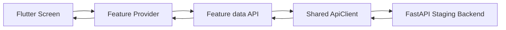
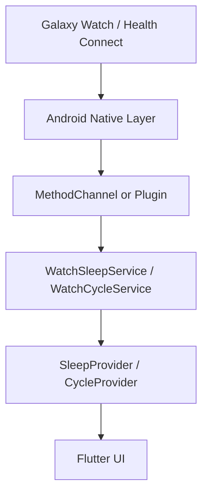
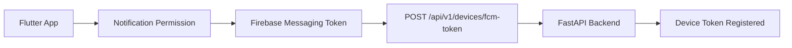

# Frontend Architecture & Integration

Flutter Android 앱의 아키텍처, 데이터 흐름, backend / wearable / 알림 통합 계약을 정리합니다.
런타임 실행과 테스트 절차는 루트 [`README.md`](../README.md) §4를 참고하세요.

## 목차

- [아키텍처](#아키텍처)
- [Data Flow](#data-flow)
- [Backend Integration Status](#backend-integration-status)
- [Watch / Sleep / Cycle Integration Contract](#watch--sleep--cycle-integration-contract)
- [Notification Flow](#notification-flow)

---

## 아키텍처

Frontend는 feature-based 구조를 따릅니다.

```text
frontend/
├── lib/
│   ├── core/
│   │   ├── config/          # API config (base URL 등)
│   │   ├── errors/          # API exception handling
│   │   ├── network/         # Shared ApiClient
│   │   ├── storage/         # Secure token storage
│   │   ├── theme/           # App colors / typography
│   │   ├── utils/           # Korean UI helper
│   │   └── widgets/         # Shared UI widgets
│   ├── features/
│   │   ├── auth/
│   │   ├── cycles/
│   │   ├── events/
│   │   ├── insight/
│   │   ├── notifications/
│   │   ├── sleep/
│   │   └── triggers/
│   ├── screens/
│   │   ├── home/
│   │   ├── insight/
│   │   └── my/
│   └── main.dart
├── test/
├── android/
├── pubspec.yaml
└── README.md
```

각 feature는 UI state, API access, models, service logic를 분리합니다.

```text
features/events/
├── data/
│   └── events_api.dart      # Backend API calls
├── models/
│   └── stress_event.dart    # Domain model
└── events_provider.dart     # UI state / refresh logic
```

### Provider 역할

- loading / error / success state 관리
- screen refresh
- session cleanup
- UI-facing state transformation

### Data Layer 역할

- backend request construction
- response parsing
- API payload compatibility
- endpoint-level error handling

---

## Data Flow



모든 Provider는 staging backend(`https://api-staging.friendlykr.com`)에 직접 요청합니다.

---

## Backend Integration Status

현재 frontend에서 구현 및 검증된 backend integration:

- Anonymous auth
- Google Sign-In frontend request flow
- `/api/v1/me`
- `/api/v1/events`
- `/api/v1/cycles/current`
- `/api/v1/cycles/history`
- `/api/v1/categories`
- `/api/v1/consent`
- `/api/v1/sleep-logs/latest`
- `/api/v1/devices/fcm-token`

검증 완료 상태:

- staging API 연결 정상
- FCM permission request 정상
- FCM device token registration 성공
- Sleep latest endpoint empty response graceful handling
- Cycle/current 및 history response 기반 UI 업데이트
- Event data provider-driven rendering

### Pending / backend-dependent

- Google OAuth audience/client ID alignment
- Email/password auth endpoints
- End-to-end push notification verification
- 일부 account security flow backend support

---

## Watch / Sleep / Cycle Integration Contract

Frontend는 향후 wearable data ingestion을 위한 service contract를 포함합니다.

현재 상태:

- UI와 Provider state는 sleep/cycle data 소비 준비 완료
- 실제 Galaxy Watch / Health Connect ingestion은 아직 미완료
- Native Android bridge / MethodChannel integration은 next-stage task

### Sleep Contract

```text
WatchSleepService
├── fellAsleepAt
├── wokeUpAt
└── endedOn
```

### Cycle Contract

```text
WatchCycleService
├── periodStart
├── periodEnd
└── estimatedCycleLength
```

### Planned Future Flow



현재 frontend는 native ingestion이 연결되더라도 major UI redesign 없이 데이터를 소비할 수 있도록 설계되었습니다.

---

## Notification Flow



현재 구현:

- Notification permission request
- FCM token acquisition
- FCM token backend registration
- Korean/English notification copy localization
