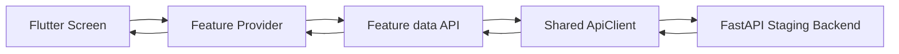
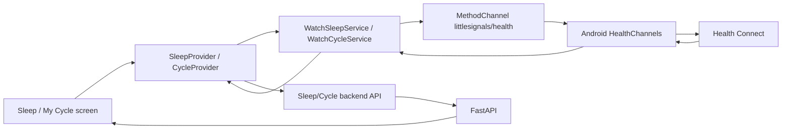

# Frontend Architecture & Integration

Flutter Android 앱의 아키텍처, 데이터 흐름, backend / Health Connect / wearable / 알림 통합 계약을 정리합니다. 실행과 테스트 절차는 루트 [`README.md`](../README.md)와 [`frontend/README.md`](../frontend/README.md)를 참고하세요.

## 목차

- [아키텍처](#아키텍처)
- [Data Flow](#data-flow)
- [Backend Integration](#backend-integration)
- [Health Connect Import](#health-connect-import)
- [Watch / Raw Biosignal Capture](#watch--raw-biosignal-capture)
- [Realtime / Notification Boundary](#realtime--notification-boundary)
- [Demo-safe Wording](#demo-safe-wording)

---

## 아키텍처

Frontend는 feature-based 구조를 따릅니다.

```text
frontend/
├── lib/
│   ├── core/
│   │   ├── config/          # API config
│   │   ├── errors/          # API exception handling
│   │   ├── network/         # Shared ApiClient
│   │   ├── storage/         # Secure token storage
│   │   ├── theme/           # App colors / typography
│   │   ├── utils/           # Korean UI helper / phase UI helper
│   │   └── widgets/         # Shared UI widgets
│   ├── features/
│   │   ├── auth/
│   │   ├── biosignals/
│   │   ├── consent/
│   │   ├── cycles/
│   │   ├── events/
│   │   ├── health/
│   │   ├── insight/
│   │   ├── notifications/
│   │   ├── sleep/
│   │   └── triggers/
│   ├── screens/
│   │   ├── home/
│   │   ├── insight/
│   │   └── my/
│   └── main.dart
├── android/
└── test/
```

각 feature는 UI state, API access, models, service logic를 분리합니다.

```text
features/events/
├── data/
│   └── events_api.dart
├── models/
│   └── stress_event.dart
└── events_provider.dart
```

### Provider 역할

- loading / error / success state 관리
- screen refresh
- session cleanup
- UI-facing state transformation
- native/service result를 backend save flow로 연결

### Data Layer 역할

- backend request construction
- response parsing
- API payload compatibility
- endpoint-level error handling

### Native Layer 역할

- Health Connect 권한 요청과 sleep/cycle record 읽기
- Watch/Wear Data Layer message 송수신
- Android foreground biosignal capture service
- phone-side ONNX inference
- raw biosignal window 암호화 및 presigned S3 upload

---

## Data Flow

### Standard REST-backed feature flow



Stress events, cycles, sleep logs, categories, consent, profile, selected-period reports는 이 flow를 사용합니다.

### Health Connect import flow



이 flow는 사용자가 직접 실행하는 import입니다. Watch raw biosignal capture나 backend WebSocket realtime과는 별개입니다.

### Raw biosignal capture flow

```mermaid
flowchart LR
    UI["Flutter Watch UI"] --> Capture["MethodChannel / EventChannel"]
    Capture --> Service["Android foreground service"]
    Service --> Source{"Source"}
    Source --> Watch["Wear Data Layer"]
    Source --> Synthetic["SyntheticSampleSource"]
    Watch --> Receiver["WatchSampleReceiver"]
    Receiver --> Buffer["WatchSourceController"]
    Synthetic --> Inference["Phone-side ONNX inference"]
    Buffer --> Inference
    Inference --> EventAPI["POST /api/v1/events"]
    Inference --> Window["WindowUploader"]
    Window --> Encrypt["Android Keystore AES-GCM"]
    Encrypt --> Batch["POST /api/v1/sync/biosignals/batch"]
    Batch --> S3["Presigned S3 PUT"]
```



Watch는 sensor node입니다. Phone native layer가 inference node입니다. Backend는 event storage, fan-out, upload metadata, presigned URL issuance를 담당합니다.

---

## Backend Integration

현재 frontend에서 사용하는 주요 backend integration:

- Anonymous auth
- Google Sign-In frontend request flow
- `/api/v1/me`
- `/api/v1/events`
- `/api/v1/cycles/current`
- `/api/v1/cycles/history`
- `/api/v1/categories`
- `/api/v1/consent`
- `/api/v1/sleep-logs/latest`
- `/api/v1/sleep-logs`
- `/api/v1/devices/fcm-token` registration/unregister
- `/api/v1/reports/range`
- `/api/v1/sync/biosignals/batch`
- `/ws/realtime`

Frontend state는 Provider가 관리하고, backend endpoint는 feature data API adapter가 캡슐화합니다.

---

## Health Connect Import

Sleep/Cycle sync UX는 Health Connect import flow입니다.

### Sleep

- Flutter service: `WatchSleepService`
- MethodChannel: `littlesignals/health`
- Native method: `getLatestSleepData`
- Android record: `SleepSessionRecord`
- Required permission: `READ_SLEEP`
- Returned fields:
  - `fellAsleepAt`
  - `wokeUpAt`
  - `endedOn`
  - `source`
- Save flow:
  - provider receives native data
  - frontend creates a `SleepLog`
  - create payload includes backend-required default rating `okay`
  - backend sleep API stores the record
  - Sleep UI refreshes from provider state

### Cycle

- Flutter service: `WatchCycleService`
- MethodChannel: `littlesignals/health`
- Native method: `getLatestCycleData`
- Android record: `MenstruationPeriodRecord`
- Required permission: `READ_MENSTRUATION`
- Returned fields:
  - `periodStart`
  - nullable `periodEnd`
  - nullable `estimatedCycleLength`
  - `source`
- Save flow:
  - provider receives native data
  - nullable `periodEnd` is valid and represents an ongoing period candidate
  - cycle API saves current period state
  - Home/My Cycle/Insight provider state refreshes

### Failure states

Flutter maps native errors to product copy:

- permission denied
- no data
- Health Connect unavailable
- native error

---

## Watch / Raw Biosignal Capture

Watch/Biosignal capture는 Health Connect import와 별도입니다.

구현된 Watch/phone native capture pipeline:

- Android foreground capture service
- Wear Data Layer start/stop/sample/end messages
- Watch-side `RemoteCaptureService`, `WatchControlListener`, `WearPhoneSender`
- Watch source and synthetic source
- Sample buffering
- 300초 buffer 기반 phone-side ONNX inference
- EventChannel detection/status stream to Flutter
- Stress event creation through `POST /api/v1/events`
- 1분 raw window upload
- Android Keystore-backed AES-GCM encryption
- `/api/v1/sync/biosignals/batch`
- presigned S3 PUT upload of encrypted ciphertext

이 기능은 wearable-oriented realtime stress detection pipeline입니다. 발표에서는 “Watch-to-phone biosignal streaming과 phone-side ONNX inference path가 구현되어 있습니다” 또는 “wearable realtime stress event pipeline implemented”로 설명할 수 있습니다. 다만 clinical/production reliability가 검증된 완성형 detector처럼 표현하지 않습니다.

---

## Realtime / Notification Boundary

Realtime 관련 channel은 서로 역할이 다릅니다.

```text
Watch -> Phone
  Wear Data Layer

Phone -> Backend
  REST API

Backend -> Flutter foreground
  WebSocket /ws/realtime

Backend -> Device background
  FCM token / push notification infrastructure

Sleep/Cycle import
  Health Connect MethodChannel, not realtime
```

`/ws/realtime`은 backend-to-Flutter channel입니다. Client는 연결 후 첫 message로 JWT를 보냅니다.

```json
{"type":"auth","token":"<jwt>"}
```

Frontend handles:

- `events.created`
- `events.updated`
- `events.deleted`

수신한 realtime envelope에 event id만 있으면 frontend는 backend에서 event detail을 fetch하고 provider state에 반영합니다.

FCM은 device token registration, logout/account-switch unregister, background push entry path를 위한 infrastructure로 연결되어 있습니다. 다만 notification grouping, retry policy, user preference/cooldown UX까지 포함한 production-complete notification product layer로 표현하지 않습니다.

---

## Demo-safe Wording

안전한 표현:

- “Health Connect 기반 수면/주기 import가 구현되어 있습니다.”
- “Galaxy Watch는 sensor node, Android phone native layer는 inference node입니다.”
- “Wear Data Layer 기반 watch-to-phone biosignal streaming이 구현되어 있습니다.”
- “Phone-side ONNX inference path와 stress event creation path가 구현되어 있습니다.”
- “Raw biosignal upload payload는 Android Keystore 기반 AES-GCM으로 암호화됩니다.”
- “Backend realtime은 `/ws/realtime`, background notification은 FCM을 사용합니다.”
- “FCM token registration/unregister와 push notification infrastructure가 구현되어 있습니다.”

피해야 할 표현:

- “Galaxy Watch가 직접 stress inference를 수행합니다.”
- “Sleep/Cycle이 Galaxy Watch에서 realtime으로 직접 sync됩니다.”
- “모든 free-text user data가 client-side encrypted입니다.”
- “완성된 production wearable stress detector입니다.”
- “FCM notification이 항상 realtime으로 보장됩니다.”
- “완성형 production notification product layer가 모두 구현되어 있습니다.”
