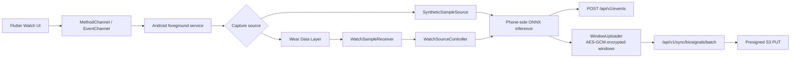

# Luma Frontend

## Overview

`frontend/`는 Luma의 Flutter 기반 Android 앱입니다. 사용자-facing 화면에서 stress logging, cycle-aware insight, sleep UI, Health Connect 기반 수면/주기 불러오기, notification registration, wearable-oriented biosignal capture UI를 담당합니다.

앱은 staging FastAPI backend와 REST API로 통신하고, Provider 기반 상태 관리로 UI, data/API layer, native Android layer를 연결합니다. 이 문서는 root README보다 실행과 구조 이해에 초점을 둔 frontend engineering README입니다.

## Tech Stack

| 영역 | 기술 |
| :--- | :--- |
| App framework | Flutter / Dart |
| State management | Provider |
| Backend communication | REST API client layer |
| Push infrastructure | Firebase Messaging / FCM token registration + unregister |
| Auth frontend flow | Anonymous auth, Google Sign-In frontend flow |
| Health data import | Android Health Connect via MethodChannel |
| Native bridge | MethodChannel / EventChannel |
| Native integration | Android foreground service, Kotlin, ONNX Runtime |
| Wear boundary | Wear Data Layer |
| Android package | `com.littlesignals.app` |

## Project Structure

```text
frontend/
├── lib/
│   ├── core/       # app config, ApiClient, secure storage, theme, shared widgets, UI formatters
│   ├── features/   # domain providers, models, API adapters, services
│   └── screens/    # Home, Insight, My/Profile, Stress Log, Cycle, Sleep, Watch UI
├── android/        # Android package, Health Connect bridge, native capture/inference service
└── test/           # Flutter unit/widget/regression smoke tests
```

`lib/core`는 공통 기반 계층입니다. API base URL, token storage, shared HTTP client, theme, reusable widgets, Korean UI text formatter를 둡니다.

`lib/features`는 domain별 provider와 data adapter를 둡니다. UI는 provider state를 읽고, provider는 `features/*/data` API adapter 또는 native service를 호출합니다.

`lib/screens`는 실제 화면 composition을 담당합니다. 화면은 backend endpoint를 직접 다루지 않고 Provider state와 action을 사용합니다.

`android`는 Flutter app의 Android runtime, Health Connect MethodChannel, Wear Data Layer boundary, foreground biosignal capture service, phone-side ONNX inference, raw window upload code를 포함합니다.

## Implemented Features

- Auth landing
- Anonymous auth
- Google Sign-In frontend request flow
- Home dashboard
- Stress log create/edit/delete
- Trigger/category management
- Cycle current/history/create/update flow
- My Cycle auto-save UX
- Health Connect cycle import
- Sleep log display states
- Health Connect sleep import
- Insight calendar / report UI
- AI selected-period report card/detail UI
- Profile / nickname editing
- Notification permission
- FCM device token registration/unregister infrastructure
- WebSocket realtime event handling
- Watch / biosignal capture UI
- Raw biosignal consent toggle
- Capture source picker
- Capture status / summary screen
- Phone-side native ONNX stress detection path
- AES-GCM encrypted raw biosignal window upload
- Korean UI copy polish
- Regression smoke tests

## Backend APIs Used

Frontend에서 사용하는 주요 backend API는 다음과 같습니다.

| 기능 | API |
| :--- | :--- |
| User profile | `/api/v1/me` |
| Stress events | `/api/v1/events` |
| Cycle current | `/api/v1/cycles/current` |
| Cycle history | `/api/v1/cycles/history` |
| Trigger/category | `/api/v1/categories` |
| Consent | `/api/v1/consent` |
| Sleep logs | `/api/v1/sleep-logs/latest`, `/api/v1/sleep-logs` |
| FCM device token | `POST /api/v1/devices/fcm-token`, `DELETE /api/v1/devices/fcm-token` |
| AI selected-period report | `/api/v1/reports/range` |
| Realtime events | `WSS /ws/realtime` |
| Biosignal batch metadata | `/api/v1/sync/biosignals/batch` |
| Raw biosignal object upload | encrypted ciphertext via presigned S3 PUT upload flow |

`/ws/realtime`은 backend-to-Flutter realtime channel입니다. Client는 WebSocket 연결 후 첫 JSON message로 `{"type":"auth","token":"..."}`를 전송합니다. Watch-to-phone communication은 WebSocket이 아니라 Wear Data Layer를 사용합니다.

FCM은 현재 device token registration, logout/account-switch unregister, foreground/background notification entry path를 위한 push infrastructure로 연결되어 있습니다. 전체 알림 제품 로직(그룹핑, retry policy, notification preference/cooldown UX 전체)을 production-complete notification system으로 주장하지 않습니다.

## Health Connect Import

Sleep/Cycle sync UX는 Health Connect import flow입니다. Galaxy Watch raw biosignal capture와 별도 기능입니다.

- Flutter `WatchSleepService` / `WatchCycleService`는 `MethodChannel('littlesignals/health')`를 호출합니다.
- Android `HealthChannels`는 `READ_SLEEP`, `READ_MENSTRUATION` 권한을 요청하고 `SleepSessionRecord`, `MenstruationPeriodRecord`를 읽습니다.
- Sleep import는 `fellAsleepAt`, `wokeUpAt`, `endedOn`, `source`를 받아 기존 sleep API로 저장합니다.
- Cycle import는 `periodStart`, nullable `periodEnd`, `estimatedCycleLength`, `source`를 받아 기존 cycle provider/API flow로 저장합니다.
- 권한 없음, 데이터 없음, Health Connect 사용 불가, native error는 분리된 사용자-facing copy로 처리합니다.

## Native Capture Infrastructure

Luma frontend에는 wearable-oriented biosignal capture infrastructure가 포함되어 있습니다. 이 범위는 raw biosignal capture/upload UX, Watch-to-phone Wear Data Layer streaming, phone-side native ONNX inference path를 설명합니다.

- Flutter `BiosignalCaptureService`
  - `MethodChannel('littlesignals/capture')`
  - `EventChannel('littlesignals/capture/status')`
  - `start`, `stop`, `isWatchConnected`, `statusStream`
- Flutter `BiosignalCaptureController`
  - capture state, elapsed seconds, uploaded window count, error, watch connection state 노출
- Android `BiosignalCaptureService`
  - foreground service로 capture session 실행
- Wear Data Layer messaging
  - `WearMessageClient`가 reachable node/capability 확인과 `/biosignals/start`, `/biosignals/stop` 전송 담당
- `WatchSampleReceiver`
  - `/biosignals/samples`, `/biosignals/end` message 수신
- `WatchSourceController`
  - HR, PPG, EDA, accelerometer sample buffering
- `SyntheticSampleSource`
  - capture/upload/inference plumbing 확인용 synthetic source
- `StreamingInferenceCoordinator` / `StressPipeline`
  - 300초 buffer 기반 phone-side ONNX inference
  - detection decision 발생 시 backend stress event 생성
- `WindowUploader`
  - 1분 단위 raw biosignal window 생성
  - Android Keystore 기반 AES-GCM 암호화
  - `/api/v1/sync/biosignals/batch` 호출
  - backend가 반환한 presigned S3 PUT URL로 ciphertext payload 업로드

이 capture path는 capstone demo에서 보여줄 수 있는 wearable-oriented capture/inference/upload pipeline입니다. Watch는 sensor/streaming node이고, Android phone native layer가 inference/upload node입니다. Sleep/Cycle Health Connect import와 섞지 않습니다.



## Running

```bash
cd frontend
flutter pub get
flutter run
```

Google OAuth web client ID를 runtime에 지정할 때:

```bash
flutter run --dart-define=LITTLESIGNALS_GOOGLE_SERVER_CLIENT_ID=YOUR_WEB_CLIENT_ID
```

## Testing

```bash
flutter analyze
flutter test
```

Regression smoke tests는 auth navigation, anonymous auth, main tabs, Home dashboard, stress log create/edit/delete, trigger management, cycle auto-save, sleep display states, notification copy, nickname/session cleanup, provider reset 같은 주요 app flow를 검증합니다.

Android native unit tests는 Android project에서 실행할 수 있습니다.

```bash
cd android
./gradlew testDebugUnitTest
```

## Configuration Notes

- 사용자-facing branding은 `Luma`입니다.
- Android package는 현재 `com.littlesignals.app`입니다.
- Google OAuth runtime env key는 현재 `LITTLESIGNALS_GOOGLE_SERVER_CLIENT_ID`입니다.
- Android package 및 일부 runtime env key는 build/runtime compatibility를 위해 유지됩니다.
- Health Connect import는 Android 기기 권한과 실제 Health Connect 데이터에 의존합니다.
- Watch source capture는 Wear OS 기기 pairing, sensor permission, Wear Data Layer reachability에 의존합니다.
- Synthetic capture source는 demo/testing용으로 native capture/upload/inference plumbing을 확인할 때 사용할 수 있습니다.

다음 local secret 또는 generated file은 commit하지 않습니다.

- `google-services.json`
- `GoogleService-Info.plist`
- `firebase_options.dart`
- `.env`
- `.env.*`
- `key.properties`
- `*.keystore`
- `*.jks`
